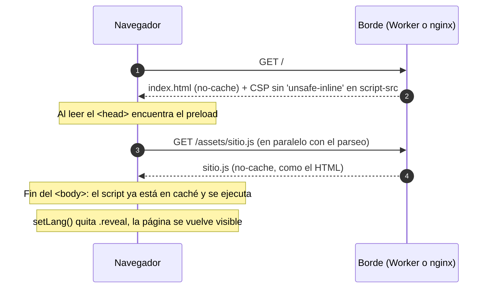

# ADR-0007: Extraer el JavaScript a `assets/sitio.js` y cerrar `script-src`

* **Estado:** accepted
* **Fecha:** 2026-09-16
* **Decisores:** Jeremi Alcalá
* **Fase AI-DLC:** 02-design
* **Versión:** 1.0.0
* **ID:** ADR-0007
* **Supersede / Superseded-by:** supersede **parcialmente a ADR-0003** — la mitad del JS. El CSS sigue inline y ADR-0003 sigue vigente para él
* **Controles OWASP afectados:** A03, A05

## Contexto

ADR-0003 dejó el CSS y el JS dentro de `index.html` y aceptó `'unsafe-inline'` en
`script-src` y `style-src` como **deuda registrada** (T4 del threat model). El argumento
era sólido y sigue siéndolo en su mitad: sin formularios, sin backend y sin contenido de
terceros, el vector que `'unsafe-inline'` deja abierto no tiene por dónde entrar.

Ese mismo ADR fijó el disparador que lo revierte: *«en cuanto el sitio incorpore una
entrada de usuario que llegue al DOM»*. No es eso lo que ha pasado. Lo que ha pasado es
otra cosa, que el ADR no había previsto:

**el sitio deja de ser una sola página.** Las políticas de privacidad, los términos y
condiciones, el aviso de cookies y la política de IA responsable son cuatro páginas nuevas
que necesitan exactamente el mismo comportamiento que la landing: el conmutador ES/EN con
su persistencia en `localStorage`, el menú móvil y el año del pie.

Con el JS dentro del HTML, eso obliga a elegir entre dos malas opciones:

1. **Copiar el script en cada página.** Cinco copias de `setLang()`. Es precisamente la
   clase de deriva que este repositorio lleva meses combatiendo con pruebas: U2.5 existe
   porque un `@font-face` duplicado se desvió, y U12 entera existe porque las cabeceras de
   seguridad viven en dos archivos. Añadir cinco copias de la lógica de idioma —en un sitio
   cuyo riesgo R2 documentado es la deriva del texto bilingüe— es crear el problema a
   sabiendas.
2. **Que las páginas legales no sean bilingües.** Incoherente con un sitio que ofrece EN, y
   peor aún en los documentos donde la versión del idioma tiene consecuencias legales.

Extraer el JS resuelve las dos, y de paso paga media deuda T4: con el JS fuera del marcado,
`script-src` puede cerrarse.

## Decisión

**Extraer todo el JavaScript de `index.html` a `assets/sitio.js`, y quitar
`'unsafe-inline'` de `script-src` en los dos caminos a producción.**

Cuatro decisiones de detalle, cada una con su motivo:

1. **Solo el JS. El CSS se queda dentro de `index.html`.** ADR-0003 sigue vigente para él,
   y por tanto `style-src 'unsafe-inline'` también. No es indecisión: el CSS inline no tiene
   el problema de duplicación que tiene el JS —las páginas legales necesitan *su propio*
   CSS, no el de la landing— y extraerlo costaría una petición bloqueante en la ruta
   crítica del render, que es exactamente lo que el presupuesto de rendimiento no puede
   pagar. La deuda T4 pasa de dos mitades a una.

2. **Sigue sin haber build step.** El archivo se sirve tal cual, sin minificar, sin hash en
   el nombre, sin bundler. ADR-0003 no se revierte en lo esencial: la restricción de «cero
   dependencias de paquetes» es la que da al sitio su superficie de supply chain nula, y
   esta decisión no la toca.

3. **Se carga al final del `<body>`, sin `defer`, con un `preload` en el `<head>`.** El
   script desreferencia nodos en su nivel superior, así que necesita el DOM parseado. El
   `preload` es lo que evita que esa posición cueste un viaje extra: la descarga arranca con
   el parseo en vez de al terminarlo. Importa más de lo que parece, porque `.reveal` está en
   `opacity: 0` esperando que el JS le añada `.in`: cada milisegundo de espera es página en
   blanco, no solo latencia.

4. **El JS no se cachea como el resto de `/assets/`.** Ese directorio se sirve `immutable`
   30 días; el HTML se revalida siempre. Un visitante podría quedarse un mes con el script
   viejo y la página nueva. Tiene su propio `location =` en nginx con la política del HTML.

*Eje comportamiento · Fase 02 · Por qué el `preload` no es decorativo: sin él, el GET del
script empieza donde ahora termina.*

## Alternativas consideradas

| Opción | Pros | Contras | Riesgo |
|---|---|---|---|
| **Extraer solo el JS (elegida)** | Una sola copia del comportamiento para las cinco páginas; `script-src` cerrado de verdad; el objetivo de mutación y cobertura pasa a ser un archivo, no un trozo de HTML | Una petición más; el JS necesita su propia regla de caché; el arnés de pruebas tiene que inyectarlo | Bajo, y acotado por U2.6, U2.7, U11.8 y U12.5 |
| Duplicar el script en cada página legal | Cero cambios de arquitectura | Cinco copias de `setLang()` divergiendo en un sitio cuyo riesgo R2 es la deriva bilingüe; `'unsafe-inline'` se queda | **Alto**: deriva silenciosa, el peor modo de fallo de este repositorio |
| Extraer además el CSS | `style-src` también se cerraría; T4 saldría del threat model | Una petición bloqueante en la ruta crítica del render; el CSS de la landing no lo reutiliza nadie | Medio: regresión medible de LCP en 3G lento |
| Hashes SHA-256 del bloque inline | CSP estricta sin sacar nada del archivo | El hash cambia con cada edición y no hay build que lo recalcule: la primera edición rompe el sitio en silencio | **Alto** (ya descartada en ADR-0003 por el mismo motivo) |
| Adoptar un bundler | Minificado, hash en el nombre, caché inmutable correcta | Reintroduce `node_modules` en el artefacto publicado | **Alto**: A03 pasa de nulo a significativo |

Sobre la última: es la que resolvería *elegantemente* el problema de caché del punto 4. Se
descarta por lo mismo que en ADR-0003 — el sitio vende no depender de cadenas frágiles— y
porque el problema que resolvería se resuelve igual con seis líneas de `nginx.conf`.

## Consecuencias

**Positivas**

- **`script-src 'self'`, sin `'unsafe-inline'`.** La CSP vuelve a hacer lo que se le pide:
  un `<script>` inyectado en el marcado no se ejecuta. La mitad de T4 deja de ser deuda
  aceptada y pasa a ser control cumplido.
- **Una sola copia del comportamiento** para la landing y las páginas legales.
- **La cobertura y la mutación miden un archivo.** `tests/cobertura.mjs` ya no localiza el
  bloque dentro del HTML ni desplaza números de línea, y Stryker muta `assets/sitio.js` en
  vez de `index.html`.

  Y las dos métricas salen **idénticas** a las de antes de mover nada, que es la prueba de
  que esto fue un traslado y no una reescritura: cobertura 100 % de funciones (17/17) y
  100 % de líneas (99/99); mutación **92,36 %, los mismos 144 mutantes, 133 muertos y 0 sin
  cobertura**. Ese «0 sin cobertura» era el riesgo concreto del cambio: el puente de realms
  del arnés detectaba la instrumentación de Stryker mirando el HTML, y si no se hubiera
  movido a mirar el JS, los 144 mutantes habrían salido sin cobertura y el score habría sido
  un 0 % que no mide nada. Pasó una vez, está documentado en `docs/04-testing/mutacion.md`.
- El `<script type="application/ld+json">` no estorba: es un bloque de datos, el parser no
  lo prepara como script y la CSP no lo evalúa. E5.1 lo confirma contra un navegador real.

**Negativas / deuda asumida**

- **Una petición más.** Mitigada con el `preload`, no eliminada.
- **Dos referencias al mismo archivo escritas a mano** —el `preload` y el `src`—. Divergir
  no rompe nada visible, solo devuelve el viaje extra que el `preload` ahorra: una
  regresión de rendimiento silenciosa. La vigila **U2.6**.
- **La política de caché del JS es una regla que hay que recordar.** Si el archivo se
  renombra, el `location =` de `nginx.conf` hay que moverlo con él, o el script hereda el
  `immutable` de 30 días de `/assets/`. La vigila **U12.5**, que además comprueba que el
  Worker siga sin fijar `Cache-Control` para que los dos caminos no divergan.
- **`style-src 'unsafe-inline'` se queda.** T4 sigue en el threat model, con la mitad del
  alcance.
- **El arnés de las unitarias es menos directo.** Ya no basta con cargar el HTML: hay que
  insertar el JS donde estaba su etiqueta. Se hace así —y no con `resources: 'usable'` de
  jsdom— por tres razones que están escritas en `tests/helpers/cargar-dom.mjs`: el
  documento se parsea con la URL de producción y jsdom saldría a buscar el script por red;
  esa carga es asíncrona y `cargarDOM()` es sincrónico; y un script externo que lanza no
  pasa por `jsdomError`, que es el mecanismo que pone U1.1 y U1.5 en rojo.

**Impacto en threat model**

- **T4** (XSS vía CSP permisiva) baja de alcance: solo `style-src`. El vector sigue sin
  existir —no hay entrada de usuario que llegue al DOM— y la aceptación sigue en pie para
  la mitad que queda.
- **T17** (excepción temprana deja la página en blanco) no cambia de naturaleza, pero gana
  una puerta nueva: si alguien devuelve un `<script>` inline al marcado, la CSP lo bloquea y
  el resultado es indistinguible de la excepción. Por eso U11.8 falla en la unitaria, antes
  de que un navegador tenga que descubrirlo.

## Disparador de revisión

Esta decisión se revisa si el CSS crece hasta hacer inmanejable `index.html`, o si aparece
una entrada de usuario que llegue al DOM. En cualquiera de los dos casos toca extraer
también el CSS y cerrar `style-src`, con lo que T4 desaparece del threat model.
