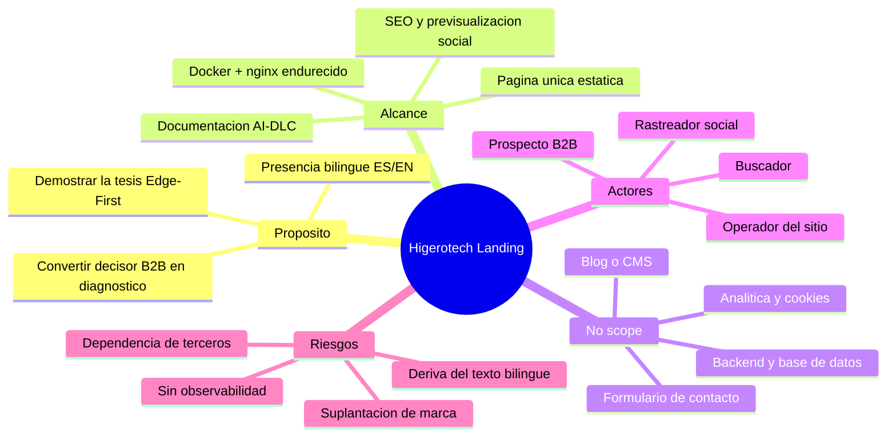

# Project Charter — Higerotech Landing

* **Estado:** approved
* **Fecha:** 2026-07-29
* **Decisores:** Jeremi Alcalá
* **Fase AI-DLC:** 00-project
* **Versión:** 0.1.0
* **Sponsor:** Higerotech
* **Owner del proyecto:** Jeremi Alcalá

## Visión

Ser la primera prueba de la tesis que Higerotech vende. La landing no solo describe
"tecnología resiliente que no se detiene jamás": tiene que **comportarse** así — cargar
íntegra sin depender de terceros, seguir siendo legible sin JavaScript y sin webfonts, y
no romperse en una conexión mala. Un sitio que predica Edge-First y bloquea su render en
un CDN ajeno contradice su propio argumento comercial.

Su función de negocio es convertir a un decisor B2B venezolano (director de tecnología,
gerente de operaciones, dueño de empresa mediana) en una conversación de diagnóstico.

## Alcance

**Incluye**
- Página única, bilingüe ES/EN, en modo oscuro, con las siete secciones de contenido:
  dolores del contexto, servicios, metodología AI-DLC, arquitectura Edge-First, cumplimiento,
  valores y llamada a la acción.
- Empaquetado reproducible en Docker sobre nginx, con configuración endurecida versionada.
- Metadatos de indexación y previsualización al compartir (Open Graph, JSON-LD, sitemap).
- Documentación AI-DLC del propio repositorio.

**No incluye (no-scope)**
- Backend, base de datos, API o cualquier estado en servidor.
- Formulario de contacto. El contacto es por `mailto:` y WhatsApp — sin formulario no hay
  datos personales que custodiar, ni validación de entrada, ni CAPTCHA, ni cumplimiento
  de tratamiento de datos. Es una decisión, no una carencia.
- Analítica y cookies. El sitio no emite ninguna cookie; por eso tampoco necesita banner
  de consentimiento.
- Blog, casos de estudio o CMS.
- Terminación TLS y borde de red (viven fuera de este repositorio).

## Mapa mental del alcance

*Eje trazabilidad · Fase 00 · Alcance acordado y sus fronteras.*

## Stakeholders

| Rol | Nombre | Responsabilidad |
|---|---|---|
| Sponsor / Owner | Jeremi Alcalá | Decide alcance, aprueba gates, opera el despliegue |
| Arquitectura | Jeremi Alcalá | ADRs, threat model, configuración de nginx |
| Contenido y marca | `<TODO: confirmar responsable>` | Copy ES/EN, coherencia de mensaje |
| Destinatario | Decisor B2B venezolano | No participa; es a quien se mide |

## Restricciones y supuestos

**Restricciones**
- **Sin dependencias de paquetes.** Ni npm ni build step (ADR-0003). Cualquiera con un
  editor debe poder cambiar el sitio; introducir una cadena de build reintroduce el riesgo
  de supply chain que hoy es exactamente cero.
- **Sin recursos de terceros.** Todo same-origin (ADR-0004). Habilita una CSP cerrada y
  evita filtrar IPs de visitantes a terceros.
- **Un solo archivo HTML.** El CSS y el JS viven dentro de `index.html` (ADR-0003). Se
  acepta el coste: obliga a `'unsafe-inline'` en la CSP.
- El entorno de destino es un único host con Docker; no hay orquestador ni réplica.

**Supuestos**
- El dominio es `higerotech.com`. **Confirmado por el owner el 2026-07-30**; deja de ser
  supuesto. Es el valor que ya usan `canonical`, `hreflang`, Open Graph, JSON-LD,
  `robots.txt` y `sitemap.xml`, así que no hay nada que cambiar en el contenido.
- Una parte relevante del público navega desde conexiones intermitentes y dispositivos
  modestos. De ahí el presupuesto de rendimiento y la degradación sin JS.
- El contenido cambia con poca frecuencia: no se justifica un CMS.

## Métricas de éxito del proyecto

| Métrica | Objetivo | Cómo se mide |
|---|---|---|
| Contactos cualificados por mes | `<TODO: fijar línea base>` | Correos y mensajes recibidos |
| LCP en 3G lento | < 2,5 s | Lighthouse |
| Peso de la primera carga | < 350 KB | DevTools, red limpia |
| Accesibilidad | Sin incidencias de contraste ni ARIA | axe-core |
| Previsualización al compartir | Título, descripción e imagen correctos | Validadores de OG |
| Disponibilidad | 99,5 % mensual | Monitor externo (**pendiente**, Gate 5) |

Nota: el 99,5 % es el SLO **de esta landing**, distinto de los SLAs de 99,9–99,999 % que el
sitio ofrece como servicio a clientes. Con un contenedor en un host sin réplica, prometer
más sería falso.

## Riesgos de alto nivel

| # | Riesgo | Impacto | Mitigación |
|---|---|---|---|
| R1 | Sin observabilidad: una caída puede pasar horas inadvertida | Alto | Gate 5 abierto. Ya ocurrió: contenedor `unhealthy` 24 h sin aviso |
| R2 | Deriva del texto bilingüe: editar el HTML visible sin `data-es` borra el cambio al cargar | Medio | Regla en `CONTRIBUTING.md`; candidato a prueba E2E |
| R3 | Suplantación de marca en dominio parecido | Medio | Fuera del control del repo; vigilancia de dominios |
| R4 | Punto único de fallo: un host, un contenedor | Medio | Aceptado para el alcance actual |
| R5 | Datos de contacto expuestos a scrapers | Bajo | Aceptado: son información comercial pública |
