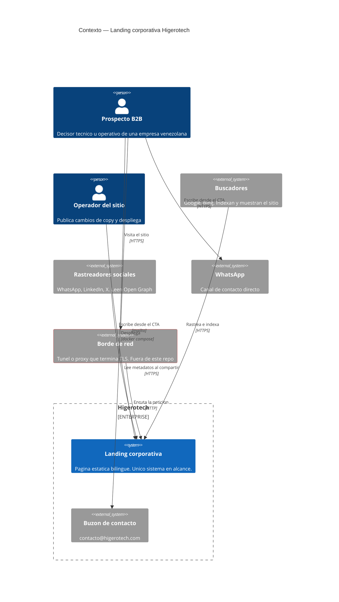
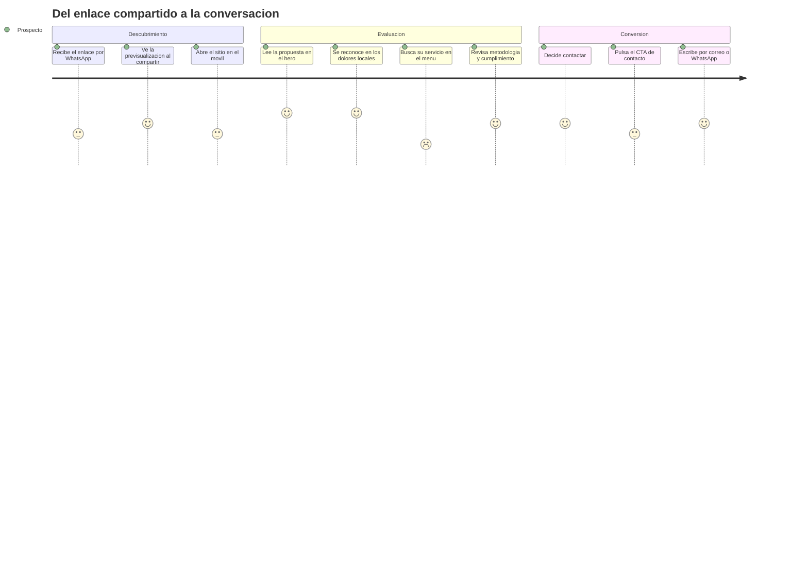
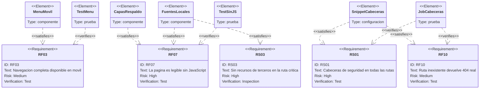
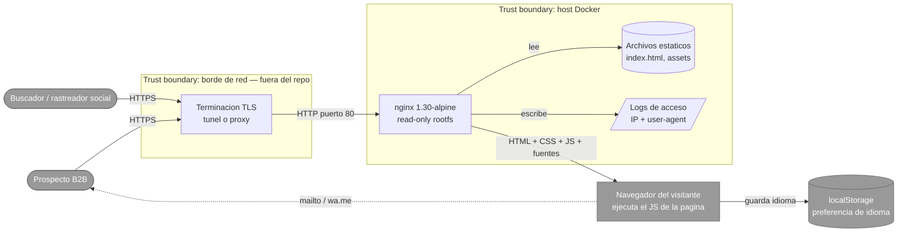
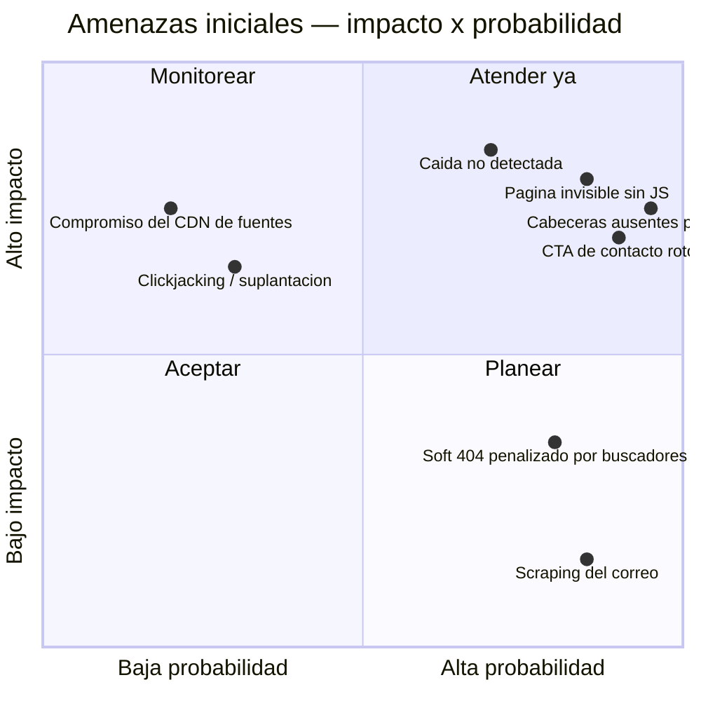

# PRD — Landing corporativa Higerotech

* **Estado:** approved
* **Fecha:** 2026-07-29
* **Decisores:** Jeremi Alcalá
* **Fase AI-DLC:** 01-requirements
* **Versión:** 0.1.0
* **Gate:** 0
* **Feature/Épica ID:** LAND-001
* **Nivel ASVS objetivo:** L1

## Problema y contexto

Higerotech vende consultoría tecnológica AI-First a empresas B2B venezolanas. Su
diferenciador no es "hacemos software": es que entiende fricciones locales concretas —cortes
eléctricos, IGTF, Resolución 001-21 de SUDEBAN, contabilidad hiperinflacionaria— y las
resuelve con ingeniería de nivel internacional.

El problema comercial: ese diferenciador no cabe en una conversación de ascensor. Un decisor
que oye "consultora AI-First" lo archiva junto a las demás. Hace falta un lugar donde el
argumento se despliegue completo y donde la propia ejecución respalde la promesa.

De ahí un requisito poco habitual en una landing: **el sitio tiene que comportarse como
aquello que vende**. Si predica resiliencia y arquitecturas que no dependen de enlaces
frágiles, no puede quedarse en blanco porque falle un script o un CDN ajeno. Este requisito
—no un capricho de rendimiento— es el que origina RF07, RS03 y las ADR-0004 y ADR-0005.

## Objetivos / No-objetivos

**Objetivos**
1. Convertir a un decisor B2B en una conversación de diagnóstico (correo o WhatsApp).
2. Comunicar el espectro completo de servicios y la metodología AI-DLC.
3. Demostrar la tesis técnica mediante el propio comportamiento de la página.
4. Servir en español e inglés desde una sola URL, de forma indexable.

**No objetivos**
- Cerrar la venta en la web. El objetivo es la conversación, no el contrato.
- Recolectar datos del visitante. Sin formularios, sin analítica, sin cookies.
- Publicar contenido periódico (blog, casos). Es una landing, no un sitio de contenidos.

## Contexto del sistema (C4 Context)

*Eje estructura · Fase 01 · Qué es el sistema, quién lo usa y de qué depende.*

Todo actor externo está **fuera** de la frontera de confianza. El borde de red se marca en
rojo porque termina TLS y no está bajo control de este repositorio (ver A04).

## Usuarios y escenarios

### Journey del usuario

*Eje trazabilidad · Fase 01 · Experiencia real y puntos de fricción.*

Las dos puntuaciones bajas son las que originan requisitos, y ambas correspondían a defectos
verificados en la versión anterior:

- **"Busca su servicio en el menú" (2)** — en móvil el menú desaparecía sin reemplazo:
  las cuatro secciones eran inalcanzables salvo por scroll manual. → RF03.
- **"Pulsa el CTA de contacto" (3)** — el botón de WhatsApp apuntaba a `https://wa.me/`
  sin número: el visitante que decidía contactar acababa en una página genérica. → RF05.

## Escenarios positivos

| # | Escenario | Resultado esperado |
|---|---|---|
| EP01 | Visita desde móvil con 3G lento | Contenido legible antes de 2,5 s; tipografía del sistema si la webfont tarda |
| EP02 | Comparte el enlace por WhatsApp | Previsualización con título, descripción e imagen 1200×630 |
| EP03 | Visitante anglófono abre `?lang=en` | Página en inglés desde la primera pintura; URL compartible |
| EP04 | Vuelve tras haber elegido inglés | Se respeta la preferencia guardada |
| EP05 | Navega solo con teclado | Foco visible en todo elemento interactivo; menú operable con Enter y Escape |
| EP06 | Buscador rastrea el sitio | Una URL canónica, `hreflang` para ambos idiomas, JSON-LD de la organización |

## Escenarios negativos / abuso (requerido por Gate 0)

| # | Escenario | Vector | Respuesta esperada |
|---|---|---|---|
| **EA01** | El visitante tiene JavaScript deshabilitado o bloqueado por una extensión corporativa | Ausencia de JS | La página sigue siendo legible al 100 %. Antes: el 80 % quedaba invisible por `opacity: 0` |
| **EA02** | Un tercero embebe la landing en un `<iframe>` de un dominio propio para suplantar la marca o hacer clickjacking | Enmarcado | `X-Frame-Options: DENY` + `frame-ancestors 'none'`. Verificado: el intento de iframe se bloquea |
| **EA03** | Se manipula `?lang=` con un valor inesperado o un payload (`?lang=<script>`) | Parámetro de URL | Allowlist estricta `['es','en']`; cualquier otro valor cae a `es`. Nunca se interpola en el DOM |
| **EA04** | Un bot rastrea el sitio para recolectar el correo de contacto | Scraping | **Aceptado.** Es un dato comercial público. Añadir ofuscación degradaría la accesibilidad a cambio de una protección trivial de sortear |
| **EA05** | Se solicitan rutas inexistentes en masa buscando archivos expuestos (`/.git/config`, `/.env`) | Enumeración | 404 real; `location ~ /\.` deniega rutas ocultas; `.dockerignore` impide que lleguen a la imagen |
| **EA06** | Petición con `Accept-Encoding` o `Host` manipulados para provocar un error que revele la versión del servidor | Fingerprinting | `server_tokens off`: sin versión en la cabecera `Server` ni en páginas de error |

## Requisitos funcionales

| ID | Requisito | Prioridad |
|---|---|---|
| RF01 | Presentar el contenido en siete secciones navegables desde el menú | Debe |
| RF02 | Alternar ES/EN sin recargar, preservando el estado de la página | Debe |
| RF03 | Ofrecer navegación completa en móvil (≤ 980 px) | Debe |
| RF04 | Exponer contacto por correo desde al menos dos puntos de la página | Debe |
| RF05 | Exponer contacto por WhatsApp **solo si hay un número configurado** | Debe |
| RF06 | Generar previsualización correcta al compartir en redes | Debe |
| RF07 | Permanecer legible sin JavaScript y sin webfonts | Debe |
| RF08 | Persistir la preferencia de idioma entre visitas | Debería |
| RF09 | Hacer el idioma compartible e indexable vía `?lang=` | Debería |
| RF10 | Responder 404 real ante rutas inexistentes | Debe |
| RF11 | Respetar `prefers-reduced-motion` | Debe |

Sobre RF05: la formulación es deliberada. El requisito no es "tener un botón de WhatsApp",
es "no publicar un CTA que no lleve a ninguna parte". Mientras `CONTACT.whatsapp` esté vacío,
el botón no se muestra.

## Trazabilidad de requisitos

*Eje trazabilidad · Fase 01 · Requisito ↔ elemento que lo satisface ↔ prueba que lo verifica.*

Nota honesta sobre este diagrama: `JobCabeceras` existe y funciona
(`.github/workflows/security-gates.yml`). `TestMenu` y `TestSinJS` **están especificados pero
no implementados** — es la brecha que mantiene el Gate 3 abierto. El diagrama muestra el
círculo que debe cerrarse, no uno que ya esté cerrado.

## Requisitos de seguridad (mapeados a OWASP ASVS)

| Req | Descripción | ASVS | Nivel | OWASP Top 10 |
|---|---|---|---|---|
| RS01 | Cabeceras de seguridad presentes en **todas** las rutas, no solo en la raíz | V14.4 | L1 | A02 |
| RS02 | CSP que restrinja origen de scripts, estilos, fuentes e imágenes | V14.4.3 | L1 | A02, A05 |
| RS03 | Ningún recurso de terceros en la ruta crítica de render | V14.2 | L1 | A03, A08 |
| RS04 | El servidor no revela su versión ni detalles internos en errores | V14.3 | L1 | A02, A10 |
| RS05 | Todo parámetro de URL validado contra allowlist antes de usarse | V5.1 | L1 | A05 |
| RS06 | Condiciones excepcionales manejadas sin dejar la página inservible | V7.4 | L1 | A10 |
| RS07 | Sin secretos ni credenciales en el repositorio ni en la imagen | V14.1 | L1 | A02, A03 |

Nivel objetivo **L1** justificado en `.ai-dlc/gates/gate-0-requirements.md`: sin
autenticación, sin datos de usuario y sin transacciones, los controles de L2 no tienen objeto.

## Threat assessment inicial

### Diagrama de flujo de datos

*Eje comportamiento · Fase 01 · Fronteras de confianza — insumo directo del STRIDE de Gate 1.*

Dos observaciones que condicionan todo el análisis: **no existe flujo de datos del visitante
hacia el servidor** más allá de la propia petición HTTP (no hay formularios ni API), y el
único dato personal del sistema son los logs de acceso.

### Priorización DREAD inicial

*Eje trazabilidad · Fase 01 · Priorización inicial. El análisis STRIDE completo con scores
DREAD numéricos está en `docs/02-design/threat-model.md`.*

Las tres del cuadrante superior derecho no eran hipótesis: eran defectos presentes y
verificados en la versión anterior, corregidos en el commit `7c7bc78`. "Caída no detectada"
sigue abierta y es la que mantiene el Gate 5 sin superar.

## Métricas de éxito

Definidas en `docs/00-project/charter.md` §Métricas de éxito.

## Dependencias y riesgos

| # | Dependencia / riesgo | Estado |
|---|---|---|
| D1 | Dominio `higerotech.com` confirmado | `<TODO>` — condiciona canonical, `hreflang`, sitemap y URLs de Open Graph |
| D2 | Número de WhatsApp corporativo | `<TODO>` — RF05 no se puede verificar hasta tenerlo |
| D3 | Imagen base `nginx:1.30-alpine` | Vigente; pendiente anclar por digest |
| D4 | Terminación TLS en el borde | Fuera del repositorio; pendiente documentar quién y dónde |
| R1 | Sin observabilidad: una caída pasa inadvertida | **Abierto** — Gate 5 |
| R2 | Deriva del texto bilingüe entre HTML visible y `data-es` | Mitigado por proceso; pendiente prueba automatizada |
| R3 | Tarjeta social generada con tipografía del sistema, no la de marca | Menor — pendiente versión de diseño |
