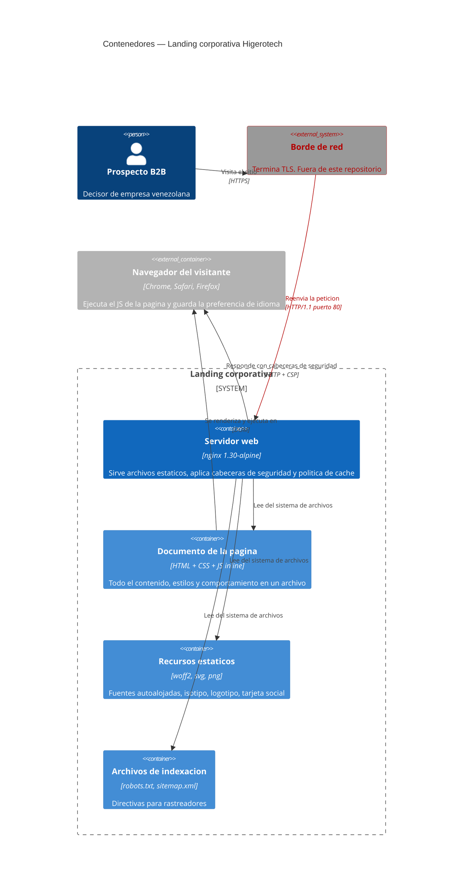
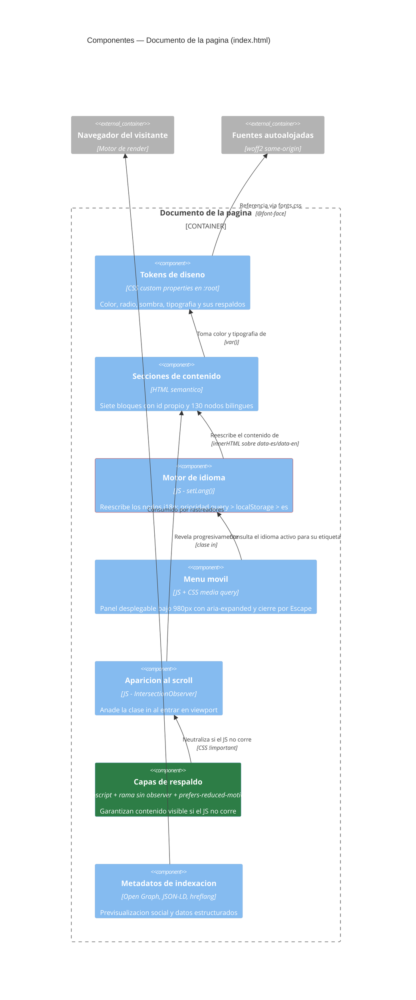
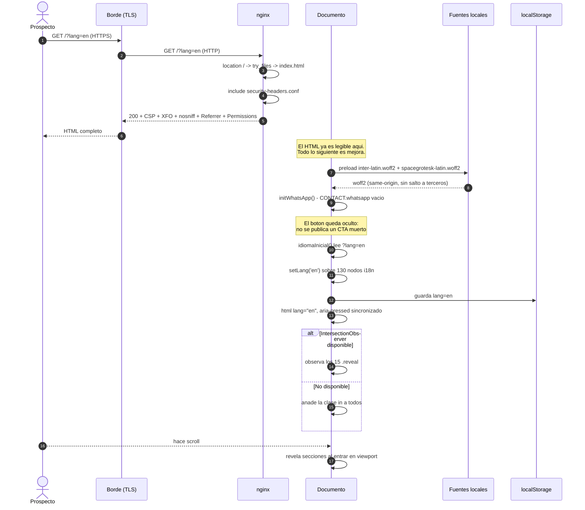
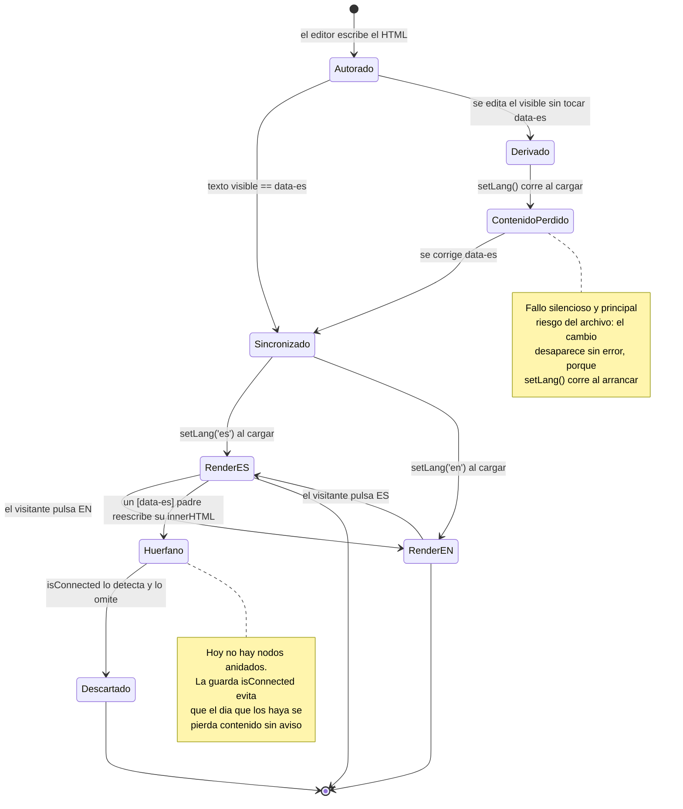
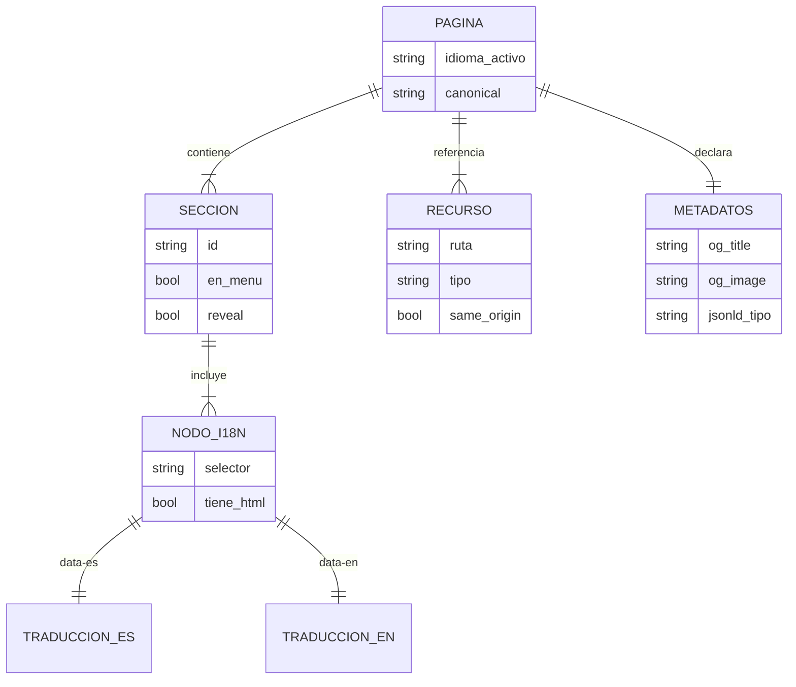
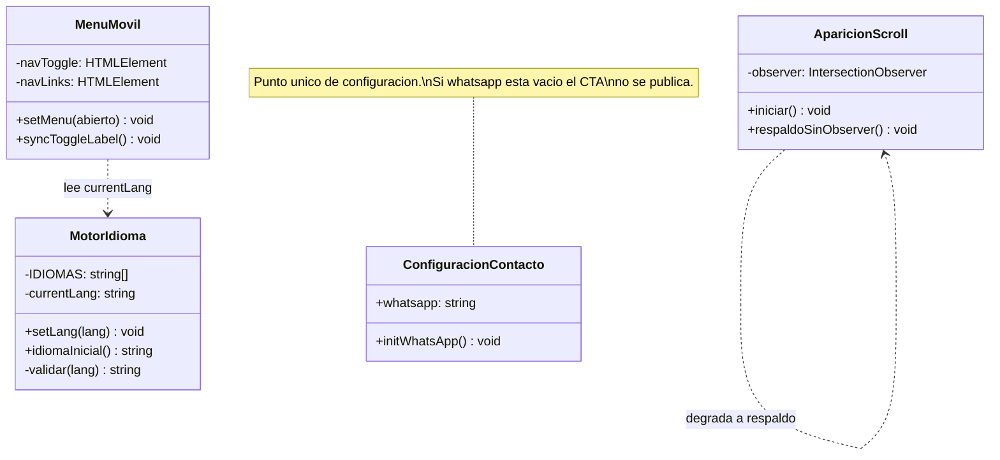

# Diseño del Sistema — Landing corporativa Higerotech

* **Estado:** approved
* **Fecha:** 2026-07-29
* **Decisores:** Jeremi Alcalá
* **Fase AI-DLC:** 02-design
* **Versión:** 0.3.0
* **Gate:** 1
* **Estilo arquitectónico:** Sitio estático servido desde el borde — sin capas de aplicación
* **ADRs relacionadas:** ADR-0001, ADR-0002, ADR-0003, ADR-0004, ADR-0005, ADR-0006

## Nota sobre el estilo arquitectónico

AI-DLC prescribe Clean Architecture, DDD y separación en capas. **Aquí no aplican**, y
forzarlos sería peor que omitirlos: no hay lógica de dominio, ni casos de uso, ni
persistencia, ni puertos que invertir. Un `RespuestaService` con su `JuezPort` sobre una
página estática es ceremonia sin contenido.

Lo que sí se conserva del espíritu de esos principios es la **dirección de dependencias**:
el contenido no depende de nada externo; la presentación depende del contenido; el
comportamiento (JS) es una capa opcional encima que puede fallar sin arrastrar a las
anteriores. Esa es la separación real del sistema y es la que se documenta abajo.

## Contextos acotados (DDD)

| Bounded Context | Responsabilidad | Entidades núcleo |
|---|---|---|
| Presentación | Estructura, tokens visuales, respuesta a viewport | Sección, Token de diseño |
| Internacionalización | Alternar y persistir idioma sobre 130 nodos i18n | Nodo i18n, Idioma activo |
| Entrega | Servir con cabeceras, caché y códigos correctos | Ruta, Snippet de cabeceras |

Las fronteras son reales en el código: Presentación vive en `<style>`, i18n en `setLang()`
y sus consumidores, y Entrega íntegramente en `nginx.conf` + `security-headers.conf`. Un
cambio en Entrega no toca `index.html` y viceversa.

## Vista C4 — Container

*Eje estructura · Fase 02 · Qué piezas existen y con qué protocolo hablan.*

### Qué describe esta vista desde el 2026-07-31

**Los hostnames canónicos ya no pasan por aquí.** Desde el cutover de ADR-0006, `higerotech.com`
y `www` se sirven desde un Worker de Cloudflare con *static assets*, y esta vista describe el
**camino de contingencia**: el contenedor nginx tras el túnel, que sigue sirviendo `demo.` y
`web.`.

No se sustituye el diagrama por el del Worker, y la razón importa: **el contenedor no es un
camino muerto**. El suite completo y el escaneo DAST siguen corriendo contra él en cada PR, así
que el respaldo está verificado de forma continua — un respaldo sin probar es un respaldo que
falla el día que hace falta. La topología de los dos caminos está en
[el plan de despliegue](../05-deployment/plan-cloudflare-workers.md) §Topología objetivo.

Lo que **no** cambia con el Worker es la frontera de Entrega: las mismas cabeceras, el mismo 404
real y la misma política de caché, expresadas en `cloudflare/_headers` en vez de en
`security-headers.conf`. Que las dos definiciones no diverjan lo vigila la prueba **U12**.

## Vista C4 — Component

Se detalla `Documento de la página`, el único contenedor con internos no evidentes.

*Eje estructura · Fase 02 · Internos del documento.*

`Capas de respaldo` se destaca en verde porque es el componente que materializa RF07: sin
él, el fallo de cualquier otro deja la página en blanco. `Motor de idioma` lleva borde rojo
por ser el único sink `innerHTML` del sistema (ver A05).

## Flujos críticos (comportamiento)

Primera visita desde un enlace compartido en inglés — el camino que atraviesa más
componentes y donde el orden importa.

*Eje comportamiento · Fase 02 · Orden real de la primera visita.*

El paso 6 es el que cambió con ADR-0002: antes esa respuesta salía **sin ninguna cabecera de
seguridad**, porque `location = /index.html` declaraba su propio `Cache-Control` y descartaba
la herencia del bloque `server`.

La nota tras el paso 7 marca la propiedad de diseño central: cuando el HTML llega, la página
ya cumple su función. Fuentes, idioma y animaciones son mejoras sobre algo que ya sirve.

## Ciclo de vida de la entidad núcleo

La entidad núcleo es el **Nodo i18n**: el elemento que porta el contenido bilingüe. Su ciclo
explica tanto el funcionamiento normal como el modo de fallo más probable del sistema.

*Eje comportamiento · Fase 02 · Ciclo de vida del nodo i18n y sus dos rutas de fallo.*

## Modelo de datos y dominio

No hay base de datos. El "modelo de datos" es la estructura del contenido, relevante porque
define qué debe mantenerse coherente al editar.

*Eje estructura · Fase 02 · Estructura del contenido.*

La restricción que sostiene el sistema: `NODO_I18N` tiene **exactamente una** `TRADUCCION_ES`
y una `TRADUCCION_EN`. No es opcional. Un nodo con `data-es` pero sin `data-en` no lo
selecciona `querySelectorAll('[data-es][data-en]')` y queda congelado en español para siempre.

`RECURSO.same_origin` es invariante: debe ser verdadero para todos (ADR-0004).

*Eje estructura (nivel Code) · Fase 02 · Únicamente donde la estructura no es evidente.*

`MotorIdioma` no depende de `MenuMovil`: la dependencia va en un solo sentido. Por eso
`setLang()` puede llamar a `syncToggleLabel()` sin acoplar el idioma al menú.

## Contratos

El sistema **no expone API**. El contrato observable es el conjunto de rutas HTTP servidas,
sus códigos y sus cabeceras. Se documenta aquí porque es lo que el pipeline verifica.

| Ruta | Método | Código | `Content-Type` | `Cache-Control` | Cabeceras de seguridad |
|---|---|---|---|---|---|
| `/` | GET | 200 | `text/html` | `no-cache, must-revalidate` | Completas |
| `/index.html` | GET | 200 | `text/html` | `no-cache, must-revalidate` | Completas |
| `/assets/**` | GET | 200 | según extensión | `public, max-age=2592000, immutable` | Completas |
| `/assets/<inexistente>` | GET | **404** | `text/html` | — | Completas |
| `/robots.txt` | GET | 200 | `text/plain` | `max-age=86400` | Completas |
| `/sitemap.xml` | GET | 200 | `text/xml` | `max-age=86400` | Completas |
| `/<cualquier-otra>` | GET | **404** | `text/html` | — | Completas |
| `/.git/config`, `/.env` | GET | **403** | — | — | — |

"Cabeceras de seguridad completas" = `X-Frame-Options`, `X-Content-Type-Options`,
`Referrer-Policy`, `Permissions-Policy`, `Content-Security-Policy`,
`Cross-Origin-Opener-Policy`, `Cross-Origin-Resource-Policy`.

Contrato verificado con la imagen construida el 2026-07-29; el job `headers` del pipeline
lo comprueba en cada PR.

## Patrones de seguridad seleccionados (por amenaza DREAD priorizada)

| Amenaza | Patrón / Control | OWASP | ADR |
|---|---|---|---|
| T1 · Cabeceras ausentes por herencia de `add_header` | Snippet incluido explícitamente en cada `location` + verificación en CI | A02 | ADR-0002 |
| T2 · Clickjacking / suplantación por enmarcado | `X-Frame-Options: DENY` + `frame-ancestors 'none'` | A02 | ADR-0002 |
| T3 · MIME sniffing | `X-Content-Type-Options: nosniff` | A02 | ADR-0002 |
| T4 · XSS con CSP permisiva | CSP cerrada salvo `'unsafe-inline'`; **riesgo aceptado** con disparador de revisión | A05 | ADR-0003 |
| T5 · Compromiso de recurso de terceros | Eliminado: todo same-origin | A03, A08 | ADR-0004 |
| T6 · Fingerprinting del servidor | `server_tokens off` | A02 | ADR-0002 |
| T7 · Degradación no controlada (página en blanco) | Tres capas de respaldo | A10 | ADR-0005 |
| T8 · Enumeración de rutas y archivos ocultos | 404 real + `location ~ /\.` + `.dockerignore` | A01, A02 | ADR-0002 |

El análisis STRIDE completo y los scores DREAD numéricos están en
[`threat-model.md`](threat-model.md).
