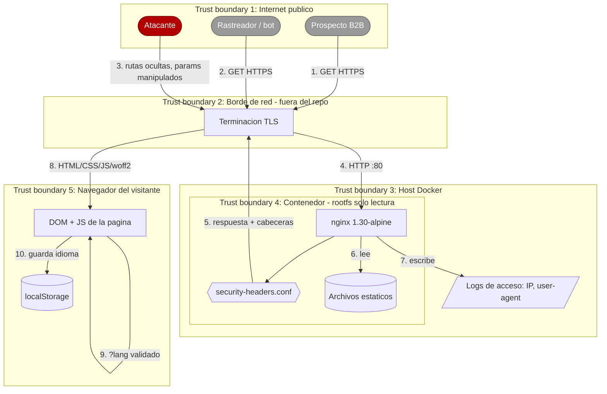
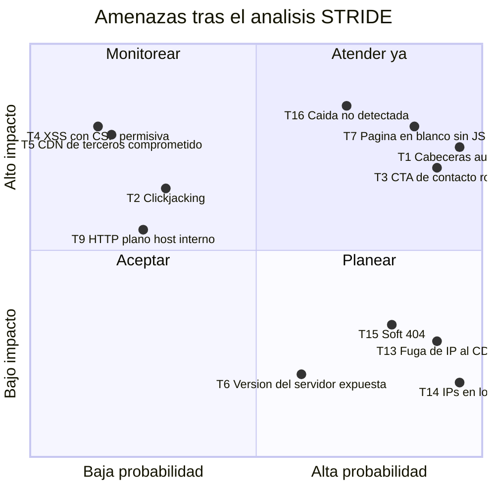

# Threat Model — Landing corporativa Higerotech

* **Estado:** approved
* **Fecha:** 2026-07-29
* **Decisores:** Jeremi Alcalá
* **Fase AI-DLC:** 02-design
* **Versión:** 0.2.0
* **Gate:** 1
* **Alcance:** Sistema completo — sitio estático, configuración de nginx e imagen de contenedor
* **Metodología:** STRIDE + DREAD
* **Clasificación de datos (ref):** [`docs/00-project/data-classification.md`](../00-project/data-classification.md)

## Encuadre

Un sitio estático tiene una superficie de ataque estrecha y poco convencional. No hay
autenticación que romper, ni base de datos que inyectar, ni sesión que secuestrar. Lo que
hay es:

1. **Configuración** — la mayor parte del riesgo real está en `nginx.conf`, no en el código.
2. **Cadena de suministro** — lo que se sirve debe ser lo que se revisó.
3. **Integridad de la experiencia** — que la página cumpla su función comercial. Una landing
   que no se ve, o cuyo CTA no lleva a ninguna parte, ha fallado igual que si estuviera caída.

El tercer punto no aparece en un STRIDE de manual, pero para este sistema es donde estaban
los defectos más caros. Se modelan como amenazas de **Denial of Service** al contenido: el
efecto para el visitante es indistinguible de una caída.

## Diagrama de flujo de datos (DFD)

*Eje comportamiento · Fase 02 · Cinco fronteras de confianza — insumo del STRIDE.*

La frontera crítica es **TB2 → TB3**: el tráfico llega en HTTP plano desde el borde. La
confidencialidad del transporte depende por completo de infraestructura que este repositorio
no controla (ver A04 y T9).

## Análisis STRIDE

| Componente | Spoofing | Tampering | Repudiation | Info Disclosure | DoS | Elevation |
|---|---|---|---|---|---|---|
| **nginx** | N/A — no autentica | T1: cabeceras ausentes por herencia rota | N/A — sin transacciones | T6: versión en cabecera `Server`; T8: rutas ocultas | T10: sin límite de tasa | N/A — rootfs de solo lectura, `cap_drop: ALL` |
| **Archivos estáticos** | N/A | T11: contenido alterado en la imagen | N/A | N/A — todo es público por diseño | N/A | N/A |
| **Documento en el navegador** | T2: enmarcado para suplantar la marca | T4: inyección si apareciera un vector de entrada | N/A | N/A | T7: página en blanco si falla el JS | N/A |
| **Motor de idioma** | N/A | T12: `?lang` manipulado | N/A | N/A | N/A | N/A |
| **Recursos de terceros** | T5: CDN comprometido sirve JS/CSS alterado | T5 | N/A | T13: fuga de IP del visitante al CDN | T5: caída del CDN bloquea el render | N/A |
| **Logs** | N/A | N/A | N/A | T14: contienen IPs | N/A | N/A |
| **Transporte borde→nginx** | N/A | T9: HTTP plano dentro del host | N/A | T9 | N/A | N/A |
| **Experiencia comercial** | N/A | N/A | N/A | N/A | T3: CTA roto; T15: soft 404 | N/A |

## Amenazas priorizadas (DREAD)

*Eje trazabilidad · Fase 02 · Priorización DREAD.*

Escala 1–10 por criterio; **Score = media**. Umbral de atención obligatoria: ≥ 5.

| ID | Amenaza | D | R | E | A | D | Score | Estado | Control / ADR |
|---|---|---|---|---|---|---|---|---|---|
| **T1** | Cabeceras de seguridad ausentes en la home y los assets por herencia rota de `add_header` | 7 | 10 | 9 | 10 | 3 | **7,8** | ✅ Cerrado | Snippet en cada `location` + job de CI · ADR-0002 |
| **T7** | La página queda invisible si el JS no se ejecuta | 8 | 10 | 8 | 9 | 2 | **7,4** | ✅ Cerrado | `noscript` + rama sin observer + reduced-motion · ADR-0005 |
| **T3** | CTA de WhatsApp apuntando a `https://wa.me/` sin número | 7 | 10 | 10 | 8 | 1 | **7,2** | ✅ Cerrado | `CONTACT.whatsapp`; el botón no se publica si está vacío |
| **T16** | Caída del sitio no detectada por ausencia de alertas | 8 | 8 | 7 | 7 | 4 | **6,8** | 🔴 **Abierto** | Ninguno. Gate 5 no superado · A09 |
| **T5** | Recurso de terceros (Google Fonts) comprometido o caído | 8 | 3 | 2 | 9 | 6 | **5,6** | ✅ Cerrado | Fuentes autoalojadas · ADR-0004 |
| **T4** | XSS aprovechando `'unsafe-inline'` en la CSP | 9 | 2 | 3 | 8 | 6 | **5,6** | ⚠️ **Aceptado** | Sin vector de entrada hoy. Disparador de revisión · ADR-0003 |
| **T2** | Enmarcado del sitio para clickjacking o suplantación | 6 | 4 | 5 | 6 | 5 | **5,2** | ✅ Cerrado | `X-Frame-Options: DENY` + `frame-ancestors 'none'` |
| **T15** | Soft 404: cualquier ruta devolvía 200 con la landing | 4 | 10 | 8 | 3 | 2 | **5,4** | ✅ Cerrado | `try_files … =404` + página 404 propia |
| **T13** | Fuga de la IP del visitante a Google al cargar fuentes | 3 | 10 | 1 | 5 | 8 | **5,4** | ✅ Cerrado | Fuentes autoalojadas · ADR-0004 |
| **T9** | Tráfico en HTTP plano entre el borde y nginx | 5 | 3 | 6 | 4 | 5 | **4,6** | ⚠️ Aceptado | Tráfico interno del host. `<TODO: documentar el borde>` |
| **T8** | Enumeración de rutas y archivos ocultos (`/.git`, `/.env`) | 7 | 3 | 6 | 2 | 3 | **4,2** | ✅ Cerrado | `location ~ /\.` deniega + `.dockerignore` |
| **T6** | Versión de nginx expuesta facilitando búsqueda de CVE | 3 | 6 | 8 | 2 | 2 | **4,2** | ✅ Cerrado | `server_tokens off` |
| **T12** | Parámetro `?lang` manipulado con payload | 6 | 2 | 4 | 3 | 4 | **3,8** | ✅ Cerrado | Allowlist `['es','en']`; nunca interpolado en el DOM |
| **T11** | Contenido alterado en la imagen entre build y despliegue | 8 | 2 | 3 | 4 | 2 | **3,8** | 🟡 Parcial | Falta firma de imagen · Gate 4 |
| **T10** | Saturación por peticiones masivas | 4 | 3 | 5 | 2 | 5 | **3,8** | ⚠️ Aceptado | Sin rate limit. Mitigable en el borde si aparece |
| **T14** | IPs de visitantes retenidas en logs de acceso | 2 | 10 | 1 | 3 | 2 | **3,6** | ⚠️ Aceptado | `access_log off` en assets; rotación 3×10 MB |

### Lectura de la priorización

Las tres amenazas con score más alto —T1, T7, T3— **no eran hipótesis**: eran defectos
presentes y verificables en la versión anterior. Por eso su *Reproducibility* y
*Exploitability* son 10: no hacía falta atacar nada, ocurría solo. Las tres están cerradas
y verificadas en el commit `7c7bc78`.

La de mayor score que sigue abierta es **T16**, y no es una amenaza de seguridad clásica sino
operativa. Durante esta revisión se constató el contenedor de producción **`unhealthy` desde
hacía 24 horas** sin que se hubiera generado ningún aviso. La amenaza no está teorizada:
está materializada ahora mismo.

Nótese el contraste entre T4 y T13. T4 (XSS) tiene el impacto más alto de la tabla pero
probabilidad muy baja: no existe un camino por el que entre contenido no confiable. T13
(fuga de IP) tenía impacto moderado pero ocurría en **el 100 % de las visitas**. Priorizar
solo por impacto habría dejado T13 sin tocar durante meses.

## Controles y trazabilidad

| Amenaza | Control implementado | Dónde vive | OWASP | Verificación |
|---|---|---|---|---|
| T1 | `include security-headers.conf` en cada `location` | `nginx.conf` | A02 | Job `headers` del pipeline; `curl -sI` en 4 rutas |
| T2 | `X-Frame-Options: DENY`, `frame-ancestors 'none'` | `security-headers.conf` | A02 | Intento de iframe bloqueado (comprobado) |
| T3 | Constante única + ocultación del botón sin número | `index.html` `CONTACT` | — | Inspección; `wa-cta.hidden === true` |
| T4 | CSP cerrada salvo `'unsafe-inline'`; riesgo aceptado | `security-headers.conf` | A05 | ADR-0003 §Disparador de revisión |
| T5, T13 | Fuentes autoalojadas; cero terceros | `assets/fonts/` | A03, A08 | Sin peticiones cross-origin en la pestaña de red |
| T6 | `server_tokens off` | `nginx.conf` | A02 | Job del pipeline verifica la cabecera `Server` |
| T7 | `<noscript>` + rama sin observer + `prefers-reduced-motion` | `index.html` | A10 | Pendiente prueba E2E · Gate 3 |
| T8 | `location ~ /\.` + `.dockerignore` | `nginx.conf`, `.dockerignore` | A01, A02 | `curl /.git/config` → 403 |
| T11 | `RUN nginx -t` en build | `Dockerfile` | A08 | Build falla si la config es inválida |
| T12 | Allowlist de idioma | `index.html` `idiomaInicial()` | A05 | `?lang=<script>` → cae a `es` |
| T15 | `try_files … =404` + `/404.html` | `nginx.conf` | A10 | Job del pipeline: 2 rutas → 404 |
| **T16** | **Ninguno** | — | **A09** | **Gate 5 no superado** |

## Riesgos aceptados — registro explícito

Se listan aparte para que no se confundan con controles cumplidos.

| ID | Riesgo | Razón de aceptación | Disparador de revisión |
|---|---|---|---|
| T4 | CSP con `'unsafe-inline'` | No hay entrada de usuario que llegue al DOM | Añadir formulario, buscador o contenido de CMS |
| T9 | HTTP plano borde→nginx | Tráfico interno del host, no atraviesa red no confiable | Separar el borde a otra máquina |
| T10 | Sin rate limiting | Contenido estático cacheable; el coste de saturar supera el beneficio | Evidencia de abuso en los logs |
| T14 | IPs en logs de acceso | Necesarias para diagnóstico; rotación agresiva y sin envío externo | Decisión de anonimizar el formato de log |
| — | Correo de contacto recolectable | Es un dato comercial público | — |

## Siguiente revisión

Este threat model se reabre cuando ocurra cualquiera de estos hechos:

1. Se añade un formulario de contacto o cualquier entrada de usuario → T4 sube a **crítico**.
2. Se añade analítica o un widget de terceros → reaparece T5 y hay que rehacer la
   clasificación de datos.
3. Se cierra Gate 5 → T16 pasa a controlado y deja de ser la amenaza abierta de mayor score.
4. El sitio se mueve a una topología con más de un host → cambian TB3 y T9.
