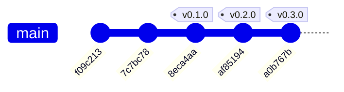

# Historial de implementación — Landing corporativa Higerotech

* **Estado:** review
* **Fecha:** 2026-07-29
* **Decisores:** Jeremi Alcalá
* **Fase AI-DLC:** 03-implementation
* **Versión:** 0.3.0
* **Gate:** 2 — **no superado** (ver `.ai-dlc/gates/gate-2-implementation.md`)
* **Rama principal:** main
* **Estrategia de branching:** trunk-based

> **Este documento se deriva, no se escribe.** La sección siguiente se regenera con:
>
> ```bash
> python "<ruta-skill-ai-dlc>/scripts/gitgraph_from_log.py" . --branch main \
>   --out docs/03-implementation/_derivado.md
> ```
>
> Regenerar tras cada merge o tag para que la traza no se desincronice. La bitácora es la
> fuente de verdad; el grafo es una vista.

## Historial del repositorio (documentación viva)

### Grafo de commits y merges



Historia lineal: sin ramas ni merges todavía. El repositorio se inicializó el 2026-07-29 y
todo el trabajo se hizo sobre `main`. En cuanto entre una segunda persona, el flujo pasa a
rama por cambio + PR, como exige `CONTRIBUTING.md`, y el grafo dejará de ser una línea recta.

### Bitácora de cambios (fiel al repo)

| Commit | Tipo | Tags | Autor | Fecha | Mensaje |
|---|---|---|---|---|---|
| `a0b767b` | commit | v0.3.0 | Jeremi Alcalá | 2026-07-29 | docs(ai-dlc): fases 03 y 05, changelog y README |
| `af85194` | commit | v0.2.0 | Jeremi Alcalá | 2026-07-29 | docs(ai-dlc): fase 02 y cierre de Gate 1 |
| `8eca4aa` | commit | v0.1.0 | Jeremi Alcalá | 2026-07-29 | docs(ai-dlc): fase 00-01 y cierre de Gate 0 |
| `7c7bc78` | commit | — | Jeremi Alcalá | 2026-07-29 | fix: corregir hallazgos de accesibilidad, SEO y seguridad de la revisión |
| `f09c213` | commit | — | Jeremi Alcalá | 2026-07-29 | chore: línea base del sitio estático previa a AI-DLC |

> Este documento se generó tras `a0b767b`, así que el commit que lo actualiza no aparece en
> su propio grafo. Es inherente a derivar del historial: siempre falta el último. Por eso la
> regla es regenerar tras cada merge o tag, no tras cada commit.

## Trazabilidad tag ↔ versión ↔ decisión

| Tag | Versión CHANGELOG | Gate | ADR / requisito | Nota |
|---|---|---|---|---|
| — | — | — | — | `f09c213` fija la línea base **antes** de tocar nada, para que el historial muestre el punto de partida real |
| — | — | — | RF03, RF05, RF07, RF10, RS01–RS06 | `7c7bc78` cierra T1, T2, T3, T5, T6, T7, T8, T12, T13 y T15 del threat model |
| `v0.1.0` | 0.1.0 | Gate 0 | ADR-0001 | Charter, glosario, clasificación de datos, PRD y estructura `.ai-dlc/` |
| `v0.2.0` | 0.2.0 | Gate 1 | ADR-0002 … ADR-0005 | Arquitectura C4, threat model STRIDE/DREAD y contratos HTTP |

Nota sobre el orden: las correcciones (`7c7bc78`) preceden a la documentación que las
justifica (`v0.1.0`, `v0.2.0`). No es el orden que prescribe AI-DLC, y conviene decirlo en
vez de disimularlo — el repositorio ya existía y estaba desplegado. Lo que sí se respetó es
que la línea base quedara registrada intacta antes de cualquier cambio, de modo que el
diagnóstico y su corrección son auditables por separado.

## Estructura del código (nivel Code)

El `classDiagram` de los componentes JS está en
[`docs/02-design/architecture.md`](../02-design/architecture.md) §Modelo de datos y dominio.
No se duplica aquí: un objeto, un diagrama.

## Estado del Gate 2

**No superado.** Dos ítems dependen de infraestructura de CI que aún no está conectada
(SAST y cobertura); un tercero (SCA) es N/A justificado porque el proyecto tiene cero
dependencias de paquetes.

Lo que sí consta: sin secretos en el repositorio, dual review completado, y verificación
funcional manual documentada en
[`docs/05-deployment/deployment.md`](../05-deployment/deployment.md) §Verificación.

Detalle en [`.ai-dlc/gates/gate-2-implementation.md`](../../.ai-dlc/gates/gate-2-implementation.md).
