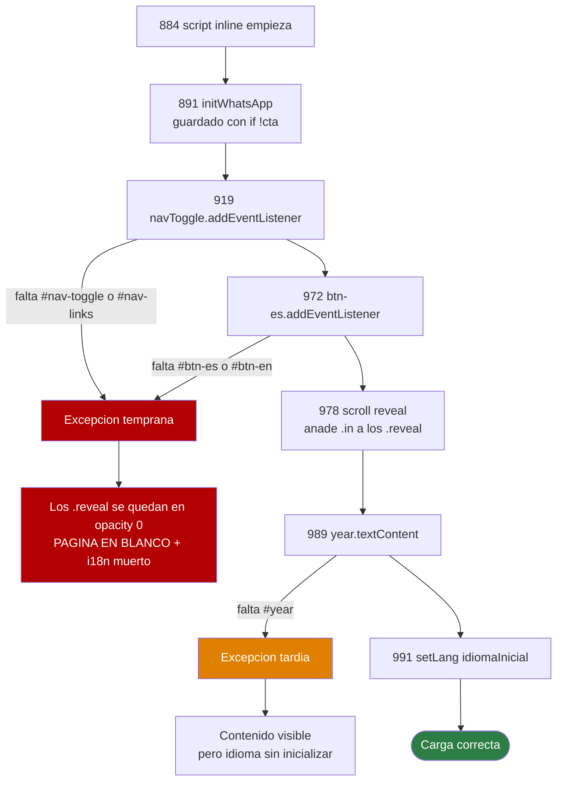

# Pruebas unitarias — Landing corporativa Higerotech

* **Estado:** draft — **diseño, sin implementar**
* **Fecha:** 2026-07-30
* **Decisores:** Jeremi Alcalá
* **Fase AI-DLC:** 04-testing
* **Versión:** 0.4.0
* **Gate:** 3 — no superado (este documento es el primer paso, no el cierre)
* **Arnés elegido:** `node:test` (stdlib) + `jsdom`
* **Alcance:** la lógica de `index.html:884-992` y los invariantes del HTML que esa lógica asume

## Por qué existe este documento

`gate-3-testing.md` afirma en su pirámide propuesta:

> | Unit | — | No aplica: no hay lógica de dominio |

**Es falso, y conviene decirlo sin rodeos.** No hay lógica *de negocio*, que es distinto. El
bloque `<script>` de `index.html` tiene cinco funciones con ramas reales, dos decisiones con
tabla de prioridad, tres degradaciones defensivas (`try/catch` de `localStorage`, fallback de
`IntersectionObserver`, guarda `isConnected`) y una clase de fallo que deja **la página en
blanco**. Todo eso es unitariamente probable y hoy no lo prueba nada.

La fila de la pirámide se corrige en este documento; el gate sigue sin superarse porque
diseñar no es implementar.

## Inventario de la lógica probable

| # | Unidad | Líneas | Ramas | Naturaleza |
|---|---|---|---|---|
| 1 | `idiomaInicial()` | 962-970 | 6 | Decisión casi pura: `location.search` + `localStorage` → `'es'\|'en'` |
| 2 | `setLang(lang)` | 937-959 | 4 | Validación + efectos en DOM + persistencia tolerante a fallo |
| 3 | `syncToggleLabel()` | 906-911 | 4 | Selección de atributo desde (`aria-expanded`, `currentLang`) |
| 4 | `setMenu(abierto)` | 913-917 | 2 | Clase + `aria-expanded` + etiqueta |
| 5 | Cableado de eventos | 919-931, 972-973 | 6 | Toggle, enlace, `Escape`, cambio de breakpoint, botones de idioma |
| 6 | `initWhatsApp()` | 891-898 | 3 | IIFE con la guarda de RF05 |
| 7 | Scroll reveal | 978-987 | 2 | Rama con `IntersectionObserver` y rama de fallback |
| 8 | Sello del año | 989 | 1 | `new Date().getFullYear()` |

Ocho unidades, ~100 líneas de lógica. Proporcionado: no hace falta una pirámide completa, hace
falta que nadie rompa en silencio lo que ya está funcionando.

## El fallo que justifica el suite

El script **no tiene aislamiento de errores**. Las líneas 903-904, 919-920, 972-973 y 989
desreferencian nodos del DOM sin ninguna guarda, y `.reveal` está en `opacity: 0`
(`index.html:109`) esperando que el JS le añada `.in`. La consecuencia es asimétrica según
*dónde* se lance:



*Eje comportamiento · Fase 04 · Por qué una errata en un `id` puede blanquear el sitio.*

Tres cosas que hacen esto peor de lo que parece:

1. **El `<noscript>` no cubre este caso.** `index.html:40` fuerza `.reveal { opacity: 1 }`
   cuando el JS está **deshabilitado**. Si el JS está habilitado y *lanza*, el `<noscript>` no
   se aplica y no hay red de seguridad.
2. **El único grupo inmune son los usuarios con `prefers-reduced-motion`**, porque
   `index.html:123` también fuerza `opacity: 1`. Es decir: el sitio se caería para la mayoría y
   seguiría bien para una minoría, que es el patrón más difícil de reproducir a partir de un
   reporte.
3. **El disparador es una errata de un carácter** en un `id`. Coste de detección con un test
   unitario: milisegundos. Coste de detección hoy: que alguien abra el sitio y avise.

Esta clase de fallo **no está registrada** ni en `threat-model.md` ni en la tabla de riesgos de
los requisitos. Es un hallazgo de este diseño; ver §Lo que este diseño destapó.

## Arnés

`node:test` de la stdlib como runner, `jsdom` como DOM. La decisión de fondo: **los tests
cargan el `index.html` real**, no una copia ni un fixture reducido. Como el JS vive inline
(ADR-0003) no se puede importar, pero sí se puede ejecutar en su archivo verdadero, y eso
elimina de raíz la posibilidad de que el test y el artefacto desplegado se desvíen.

```js
// tests/helpers/cargar-dom.mjs
import { readFileSync } from 'node:fs'
import { JSDOM, VirtualConsole } from 'jsdom'

const HTML = readFileSync(new URL('../../index.html', import.meta.url), 'utf8')

export function cargarDOM ({ url = 'https://higerotech.com/', conIO = false,
                             sustituir = null, alPreparar = () => {} } = {}) {
  let html = HTML
  if (sustituir) {
    const antes = html
    html = html.replace(sustituir.de, sustituir.a)
    // Guarda contra el test vacuo: si el fuente se reescribe y el
    // reemplazo deja de casar, el test debe fallar, no pasar por defecto.
    if (html === antes) throw new Error(`la sustitucion no caso: ${sustituir.de}`)
  }

  const errores = []
  const virtualConsole = new VirtualConsole()
  virtualConsole.on('jsdomError', e => errores.push(e))

  const dom = new JSDOM(html, {
    runScripts: 'dangerously',
    url,
    virtualConsole,
    beforeParse (win) {
      // jsdom no implementa matchMedia. Sin este stub la linea 928 lanza y
      // el script muere entero: todos los tests fallarian por un motivo que
      // no existe en ningun navegador real.
      win.matchMedia = () => ({
        matches: false,
        addEventListener () {}, removeEventListener () {}, addListener () {}
      })
      if (conIO) win.IntersectionObserver = crearIOFalso(win)
      alPreparar(win)
    }
  })

  return { dom, win: dom.window, doc: dom.window.document, errores }
}
```

Cuatro detalles del arnés que no son opcionales:

| Detalle | Por qué |
|---|---|
| `runScripts: 'dangerously'` | Es lo que ejecuta el script inline. Sin esto el DOM se parsea pero la lógica no corre |
| Stub de `matchMedia` | jsdom no lo trae; la línea 928 lo llama sin guarda. Es el stub que hace viable todo lo demás |
| `IntersectionObserver` ausente por defecto | jsdom tampoco lo trae, así que **la rama de fallback se prueba gratis**. La rama con IO necesita un doble explícito |
| `VirtualConsole` escuchando `jsdomError` | Es el mecanismo que convierte «el script lanzó» en un test rojo. Sin esto, una excepción dentro del inline se traga en silencio y el test pasa |

**Acceso a las funciones.** En un script clásico las declaraciones `function` van al objeto
global, así que `win.setLang`, `win.setMenu`, `win.syncToggleLabel` y `win.idiomaInicial` son
accesibles directamente. Las declaraciones `const`/`let` —`CONTACT`, `IDIOMAS`, `currentLang`—
**no** están en `window`: viven en el ámbito léxico global y se leen con `win.eval('IDIOMAS')`.
Conviene tenerlo escrito porque la primera reacción al ver `win.CONTACT === undefined` es pensar
que el arnés está roto.

**Aislamiento.** Un DOM nuevo por test. El script muta estado global (`currentLang`,
`localStorage`, el DOM entero), así que compartir instancia produce pases dependientes del
orden, que es la peor forma de suite verde. Coste: parsear 1017 líneas ~30 ms; con ~30 tests,
menos de 2 s en total. Se paga.

## Catálogo de casos

Ordenado por severidad del fallo que atrapa, no por comodidad de escritura.

### U1 · El script llega al final — **P0**

| Caso | Aserción |
|---|---|
| U1.1 | Cargar `index.html` real no produce ningún `jsdomError` |
| U1.2 | Tras la carga, **todo** `.reveal` tiene la clase `in` (rama de fallback) |
| U1.3 | `documentElement.lang === 'es'`, que prueba que la línea 991 se ejecutó |

U1.3 es el canario: es la última sentencia del script, así que si pasa, nada anterior lanzó.

### U2 · Contrato JS↔DOM — **P0**

| Caso | Aserción |
|---|---|
| U2.1 | Los seis `id` que el JS exige existen **y son únicos**: `wa-cta`, `nav-toggle`, `nav-links`, `btn-es`, `btn-en`, `year` |
| U2.2 | `#nav-toggle` tiene los cuatro atributos `data-label-open`, `data-label-close`, `data-label-open-en`, `data-label-close-en` |
| U2.3 | `#wa-cta` sale del HTML con `hidden` puesto |

La unicidad de U2.1 no es celo: dos elementos con el mismo `id` no lanzan, `getElementById`
devuelve el primero y el bug se manifiesta como «el botón no responde», que se depura mal.
U2.3 protege la decisión de RF05: si el atributo se cae del HTML, el enlace muerto se publica
aunque `CONTACT.whatsapp` siga vacío.

### U3 · Paridad bilingüe — **P1, riesgo R2**

R2 está registrado en los requisitos como «mitigado por proceso; **pendiente prueba
automatizada**». Esta es esa prueba. Hoy hay 130 pares.

| Caso | Aserción |
|---|---|
| U3.1 | Todo elemento con `data-es` tiene `data-en` y al revés. Se asserta el **invariante**, no el número: fijar «130» rompería el test en cada línea de copy nueva |
| U3.2 | Ningún `data-es` ni `data-en` tiene valor vacío — una traducción ausente se ve como un hueco |
| U3.3 | `setLang('en')` ⇒ cada elemento tiene `innerHTML === data-en`; `setLang('es')` ⇒ `=== data-es` |
| U3.4 | Ciclo es→en→es→en repetido cuatro veces ⇒ el contenido vuelve **exactamente** al original |
| U3.5 | Ningún valor `data-*` contiene `<script`, `<iframe`, `srcdoc` ni atributos `on…=` |
| U3.6 | No hay pares `[data-es][data-en]` anidados uno dentro de otro |

U3.4 automatiza literalmente una de las comprobaciones manuales de
`deployment.md` §Verificación («cambio de idioma repetido, 4 ciclos, sin pérdida de nodos»).

U3.5 merece explicación: `setLang` inyecta esos valores con **`innerHTML`**, y los valores
contienen markup de autor a propósito (`<span class='grad'>`, `<strong>`). Es contenido estático
horneado en la imagen, así que hoy no hay riesgo; pero un `` pegado en un
`data-en` **sí ejecutaría**, y `innerHTML` no filtra nada. El test es una lista blanca implícita
que cuesta cinco líneas. Mapea al A05 del `owasp-mapping.md`.

U3.6 valida —o retira— la guarda `isConnected` de la línea 953: hoy no hay anidamiento, así que
la guarda es precautoria. Si el test la respalda, la guarda puede quedarse tranquila; si algún
día falla, el comentario de las líneas 949-951 explica exactamente qué se pierde.

### U4 · `idiomaInicial()` — **P2**

| Caso | URL | `localStorage` | Esperado |
|---|---|---|---|
| U4.1 | `?lang=en` | vacío | `en` |
| U4.2 | `?lang=es` | `en` | `es` — la query gana sobre lo guardado |
| U4.3 | `?lang=fr` | `en` | `en` — query inválida cae al guardado |
| U4.4 | `?lang=fr` | `fr` | `es` — ambos inválidos, default |
| U4.5 | sin query | `en` | `en` |
| U4.6 | sin query | `getItem` lanza | `es` — modo privado, sin propagar |
| U4.7 | `?lang=EN` | vacío | `es` **(comportamiento actual, ver abajo)** |

U4.6 se monta redefiniendo `localStorage.getItem` en `alPreparar`; es la rama que el propio
código comenta como «localStorage bloqueado» y que hoy nadie ha ejercitado nunca.

U4.7 **no es un test, es una pregunta.** `IDIOMAS.indexOf(q)` distingue mayúsculas, así que un
enlace compartido con `?lang=EN` sirve español sin avisar. El test pinta el comportamiento
actual para que quede fijado; si la respuesta es «debería aceptar `EN`», el arreglo es un
`.toLowerCase()` y el test cambia de expectativa. Lo que no debe pasar es que siga siendo
accidental.

### U5 · Efectos de `setLang()` — **P2**

| Caso | Aserción |
|---|---|
| U5.1 | `setLang('fr')` ⇒ cae a `es` y `documentElement.lang === 'es'` |
| U5.2 | `aria-pressed` y la clase `active` son mutuamente excluyentes entre `#btn-es` y `#btn-en` |
| U5.3 | El idioma queda persistido en `localStorage` |
| U5.4 | Si `setItem` lanza, la excepción no propaga **y el DOM ya quedó actualizado** |
| U5.5 | `currentLang` (vía `eval`) y la `aria-label` del toggle reflejan el idioma nuevo |

U5.4 aprovecha que `localStorage.setItem` es la **última** sentencia de la función: el orden
garantiza que un fallo de persistencia no deja el idioma a medio aplicar. El test fija ese orden
para que un refactor no lo invierta sin darse cuenta.

### U6 · `syncToggleLabel()` — **P4**

Cuatro combinaciones: menú abierto/cerrado × idioma es/en, cada una debe dejar en `aria-label`
el valor del atributo correspondiente.

**Los valores esperados se leen del propio DOM** (`navToggle.getAttribute('data-label-open-en')`),
nunca como literales en el test. Si se hardcodean, cada ajuste de copy rompe el suite y el
equipo aprende a ignorarlo, que es como mueren las suites.

### U7 · `setMenu()` y cableado — **P4, los tres bugs de `7c7bc78`**

| Caso | Aserción |
|---|---|
| U7.1 | Click en `#nav-toggle` abre (clase `open` + `aria-expanded="true"`); el segundo click cierra |
| U7.2 | Click en un `<a>` dentro de `#nav-links` cierra el menú |
| U7.3 | Click en `#nav-links` **fuera** de un enlace no cierra |
| U7.4 | `Escape` con el menú abierto cierra **y devuelve el foco a `#nav-toggle`** |
| U7.5 | `Escape` con el menú cerrado no toca `aria-expanded` |
| U7.6 | El handler de `matchMedia` con `matches: true` cierra el menú |

U7.6 tiene un límite honesto: verifica **el cableado**, no el breakpoint. Que el umbral correcto
sea 981px solo lo puede afirmar un navegador real midiendo, y eso es E2E.

### U8 · `initWhatsApp()` / RF05 — **P3**

| Caso | Aserción |
|---|---|
| U8.1 | Con `whatsapp: ''` (estado actual) ⇒ `#wa-cta` sigue `hidden` y sin `href` a `wa.me` |
| U8.2 | Con `whatsapp: '584121234567'` ⇒ `href` exacto, `target="_blank"`, `rel` con `noopener` y `noreferrer`, `hidden = false` |
| U8.3 | El literal del fuente, si no está vacío, debe ser **solo dígitos** |
| U8.4 | La sustitución del fixture casó de verdad (guarda contra el test vacuo) |

U8.2 es el único caso que necesita tocar el fuente: `CONTACT` es `const` y `initWhatsApp` es una
IIFE que ya corrió, así que la única costura honesta es sustituir el literal antes de parsear.
De ahí U8.4: un `replace` que deja de casar convertiría el test en un pase vacío, y un test que
no puede fallar es peor que no tenerlo.

U8.3 es el que se cobra el día que se rellene el número. `'+58 412-1234567'` es la forma natural
de escribirlo y produciría `https://wa.me/+58 412-1234567`, un enlace roto — exactamente el
«enlace muerto» que el comentario del código dice querer evitar.

### U9 · Scroll reveal — **P5**

| Caso | Aserción |
|---|---|
| U9.1 | Sin `IntersectionObserver` ⇒ todos los `.reveal` reciben `.in` |
| U9.2 | Con IO doble ⇒ se observan todos los `.reveal`; al disparar `isIntersecting` en uno, ese recibe `.in` y se le llama `unobserve`, y los demás no |
| U9.3 | El observer se construye con `threshold: 0.12` |

Con `.reveal` en `opacity: 0`, U9.1 es la diferencia entre un sitio visible y uno invisible en
navegadores viejos. Es el test más aburrido de escribir y el que cubre el fallo más vistoso.

### U10 · Sello del año — **P6**

Con `Date` fijado en `alPreparar`, `#year.textContent` debe ser ese año. Un `Date` fijo y no
`new Date().getFullYear()` en la aserción: comparar el año actual contra el año actual también
pasaría si alguien hubiera hardcodeado el año en el HTML.

## Lo que este nivel no puede probar

Decirlo explícitamente evita que el verde del suite se lea como más de lo que es.

| Fuera de alcance | A quién le toca |
|---|---|
| Que la CSP sea efectiva | Cabeceras de nginx: G5 del pipeline y ZAP baseline |
| Que 981px sea el breakpoint correcto | E2E en navegador real |
| Contraste, árbol de accesibilidad, orden de encabezados | `axe-core` sobre navegador real |
| LCP, peso de la primera carga | Lighthouse CI |
| Que el 404 sea un 404 de verdad | Ya cubierto por G6 del pipeline |
| **Que lo publicado sea esta imagen** | El cuarto paso de verificación por el borde (`README.md` §Verificar antes de publicar) |

La última fila es la lección del 2026-07-30 aplicada aquí: un suite unitario verde avala el
**artefacto**. Que ese artefacto sea el que sirve el sitio es una propiedad distinta, y este
proyecto ya sabe lo que cuesta confundirlas.

## Consecuencias de segundo orden

Este diseño no es gratis y conviene tenerlo por escrito antes de implementarlo.

| # | Consecuencia | Acción |
|---|---|---|
| 1 | **El repo deja de tener cero dependencias.** `jsdom` arrastra decenas de paquetes transitivos | El gate SCA pasa de «N/A por ausencia» a **aplicable**: hay que cablear escaneo de dependencias (Trivy fs sobre el lockfile) y el gate canónico `license` por fin tiene sujeto |
| 2 | `.dockerignore` no excluye `node_modules/`, `tests/` ni `package*.json` | Añadirlos. El `Dockerfile` copia archivos concretos, así que **no llegarían a la imagen**, pero `node_modules` en el contexto de build ralentiza cada `docker build` |
| 3 | El bloque «Gate 3» del workflow es un `TODO` | Su primer viñeta pasa a ser un job real de unitarias, que debe correr **antes** que los jobs de contenedor: es el más rápido y el que falla más barato |
| 4 | `actions/setup-node` es una acción nueva en el CI | Anclarla por SHA, con el mismo criterio que se aplicó a `trivy-action` esta semana |
| 5 | El checkbox «Mutation testing ≥ 60%» del gate 3 sigue abierto | Stryker añadiría otra dependencia grande. Se deja fuera a propósito: primero que exista el suite |

La consecuencia 1 es la que merece decisión consciente. «Cero dependencias» aparece en la
documentación como una virtud del proyecto, y este diseño la gasta. A cambio compra cobertura
real de ocho unidades. Es un intercambio razonable, pero es un intercambio.

## Trazabilidad

| Test | Cubre | Registrado en |
|---|---|---|
| U3.1-U3.4 | Riesgo **R2** — deriva del texto bilingüe | `landing-corporativa.md` §Dependencias y riesgos |
| U3.5 | **A05** — inyección vía `innerHTML` de valores `data-*` | `.ai-dlc/owasp-mapping.md` |
| U7.1-U7.5 | Los tres bugs corregidos en **`7c7bc78`** | `gate-3-testing.md` §Pirámide propuesta |
| U8.1-U8.3 | **RF05** y la dependencia **D2** (número de WhatsApp) | `landing-corporativa.md` |
| U9.1 | Degradación sin `IntersectionObserver` | `index.html:975-977` |
| U1, U2 | **Clase de fallo nueva** — página en blanco por excepción temprana | Sin registrar: ver abajo |

## Lo que este diseño destapó

Dos hallazgos que no existían antes de leer el script con intención de probarlo:

1. **La página en blanco por excepción no está en ningún registro de riesgo.** Ni en
   `threat-model.md` ni en la tabla de riesgos de los requisitos. Severidad alta —el sitio
   queda inutilizable—, probabilidad baja pero no nula —una errata en un `id`—, y con un
   agravante: el `<noscript>` no la cubre y los usuarios con `prefers-reduced-motion` no la ven,
   así que llega en forma de reporte contradictorio. Propuesta: registrarla como **R4** y dejar
   que U1/U2 sean su mitigación.
2. **`?lang=EN` sirve español en silencio.** `indexOf` distingue mayúsculas. Un enlace
   compartido en mayúsculas —o generado por una herramienta que normalice al alza— pierde el
   idioma sin ningún síntoma. Decisión pendiente: aceptar y documentar, o normalizar con
   `.toLowerCase()`.

## Orden de implementación propuesto

1. `package.json` con `"test": "node --test tests/unit/"`, `jsdom` como única `devDependency`,
   y `.dockerignore` actualizado.
2. `tests/helpers/cargar-dom.mjs` — el arnés. Es donde está la dificultad real; el resto son
   aserciones.
3. **U1 y U2 primero.** Cubren la peor clase de fallo y son las más baratas.
4. **U3 después.** Es el riesgo R2, el único que el propio repositorio reconoce que le falta.
5. U4 a U10 en el orden del catálogo.
6. Job de CI en el bloque de Gate 3, antes de los jobs de contenedor.
7. Actualizar la fila «Unit» de la pirámide en `gate-3-testing.md`, que hoy dice «No aplica».
