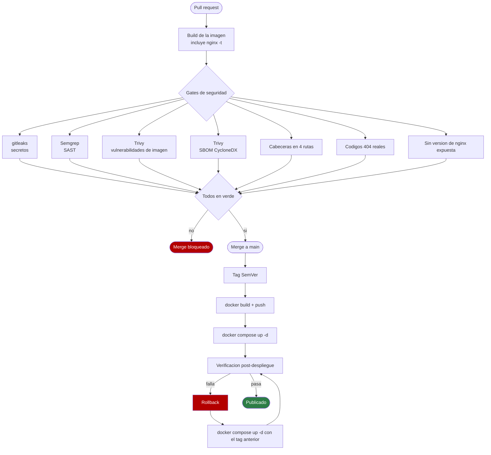
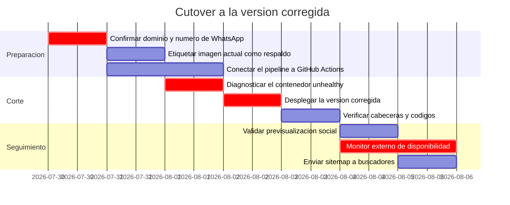

# Despliegue — Landing corporativa Higerotech

* **Estado:** review
* **Fecha:** 2026-07-29
* **Decisores:** Jeremi Alcalá
* **Fase AI-DLC:** 05-deployment
* **Versión:** 0.3.0
* **Gate:** 4 — **parcial**
* **Entorno objetivo:** Host único con Docker; borde expuesto mediante túnel
* **Estrategia de release:** Reemplazo directo del contenedor (sin blue-green ni canary)

## Topología


*Eje estructura · Fase 05 · Dónde corre cada contenedor.*

Detalle relevante para la seguridad: el túnel es **saliente**, así que el host no abre
puertos entrantes al exterior. Eso reduce mucho la superficie de red y es parte de por qué
T10 (saturación) se acepta sin rate limiting.

`<TODO: confirmar el software concreto del túnel y quién administra su configuración>`

## Pipeline



*Eje comportamiento · Fase 05 · Pipeline y ruta de rollback.*

Los pasos `MERGE` en adelante son **manuales hoy**. Solo los siete gates están automatizados
en `.github/workflows/security-gates.yml`, y de esos, Semgrep y Trivy dependen de que se
conecte el repositorio a GitHub Actions.

Los gates G5, G6 y G7 son específicos de este proyecto y merecen justificación: existen para
que los tres defectos corregidos en `7c7bc78` no puedan volver. G5 comprueba las cabeceras en
**cuatro rutas distintas**, no solo en `/`, porque el bug original era precisamente que
llegaban a unas rutas y a otras no.

## Verificación

Comprobaciones ejecutadas contra la imagen construida el **2026-07-29**. Reproducibles con
`docker compose up -d --build`.

### Cabeceras de seguridad

```bash
curl -sI http://localhost:8080/ | grep -i -E 'frame|nosniff|referrer|permissions|content-security'
```

Resultado sobre `/`:

```
Content-Security-Policy: default-src 'self'; script-src 'self' 'unsafe-inline'; style-src 'self' 'unsafe-inline'; img-src 'self' data:; font-src 'self'; connect-src 'self'; form-action 'self'; frame-ancestors 'none'; base-uri 'self'; object-src 'none'; upgrade-insecure-requests
Cross-Origin-Opener-Policy: same-origin
Cross-Origin-Resource-Policy: same-origin
Permissions-Policy: geolocation=(), microphone=(), camera=(), interest-cohort=()
Referrer-Policy: strict-origin-when-cross-origin
X-Content-Type-Options: nosniff
X-Frame-Options: DENY
```

Verificado presente además en `/index.html`, `/assets/fonts/fonts.css`,
`/assets/og-card.png`, `/robots.txt`, `/sitemap.xml` y rutas inexistentes.

### Códigos de estado y tipos de contenido

| Ruta | Código | `Content-Type` | `Cache-Control` |
|---|---|---|---|
| `/` | 200 | `text/html` | `no-cache, must-revalidate` |
| `/index.html` | 200 | `text/html` | `no-cache, must-revalidate` |
| `/robots.txt` | 200 | `text/plain` | `max-age=86400` |
| `/sitemap.xml` | 200 | `text/xml` | `max-age=86400` |
| `/assets/fonts/fonts.css` | 200 | `text/css` | `public, max-age=2592000, immutable` |
| `/assets/fonts/inter-latin.woff2` | 200 | `font/woff2` | `public, max-age=2592000, immutable` |
| `/ruta-que-no-existe` | **404** | `text/html` | — |
| `/assets/no-existe.png` | **404** | `text/html` | — |

`Server: nginx` — sin número de versión (`server_tokens off`).

### Comportamiento en navegador

Verificado en Chrome contra la imagen construida:

| Comprobación | Resultado |
|---|---|
| Fuentes cargadas | `Inter 400 700` y `Space Grotesk 400 700` — variables, same-origin |
| Familia aplicada a `h1` | `Space Grotesk` |
| SVG sin `aria-hidden` | 0 de 34 |
| Saltos de nivel de encabezado | Ninguno |
| Botón de WhatsApp | Oculto (sin número configurado) — no se publica CTA muerto |
| Año del pie | Dinámico |
| Cambio a EN | `html lang="en"`, `aria-pressed` sincronizado, preferencia guardada |
| Cuatro cambios de idioma seguidos | 130 nodos i18n intactos; `<span class="grad">`, `<strong>` y el año conservados |
| `?lang=en` | Aplica inglés desde la carga; URL compartible |
| Menú móvil | Panel abre/cierra; Escape cierra; pulsar enlace cierra; áreas táctiles de 51 px |
| Enmarcado en iframe | **Bloqueado** por `frame-ancestors 'none'` |
| Errores de consola | Ninguno |

Nota metodológica: la media query móvil se verificó por CSSOM y con las reglas aplicadas
manualmente, porque la ventana del entorno de pruebas no bajaba de 2560 px. La lógica JS sí
se ejecutó de verdad. Queda como candidata a prueba E2E real (Gate 3).

## Procedimiento de despliegue

```bash
# 1. Construir y verificar la configuracion (nginx -t corre dentro del build)
docker compose build

# 2. Levantar
docker compose up -d

# 3. Verificar antes de dar por bueno
curl -sI http://localhost:8080/ | grep -ci -E 'frame|nosniff|referrer|permissions|content-security'   # => 5
curl -s -o /dev/null -w '%{http_code}\n' http://localhost:8080/no-existe                              # => 404
docker compose ps                                                                                      # => healthy
```

Si el paso 3 no da esos tres resultados, no se publica: se hace rollback.

## Rollback

| Disparador | Acción | Tiempo objetivo |
|---|---|---|
| Cabeceras ausentes en cualquier ruta tras desplegar | Rollback inmediato | < 5 min |
| Healthcheck en `unhealthy` más de 2 minutos | Rollback inmediato | < 5 min |
| La página no renderiza o queda en blanco | Rollback inmediato | < 5 min |
| Error 5xx sostenido | Rollback inmediato | < 5 min |
| Regresión visual o de copy | Evaluar; corregir hacia adelante si no es crítico | < 24 h |

```bash
# Volver al tag anterior
docker compose down
docker tag higerotech/landing:<tag-anterior> higerotech/landing:latest
docker compose up -d

# Verificar que el rollback funciono
curl -sI http://localhost:8080/ | head -1
docker compose ps
```

**Requisito para que esto funcione:** las imágenes deben etiquetarse con la versión, no solo
con `latest`. Hoy `docker-compose.yml` fija `image: higerotech/landing:latest`, así que **no
hay imagen anterior a la que volver**. Es una carencia real del runbook.

`<TODO: etiquetar las imágenes con el tag SemVer del release y conservar al menos las dos
últimas. Sin esto, el procedimiento de rollback descrito arriba no es ejecutable.>`

## Plan de cutover



*Eje trazabilidad · Fase 05 · Secuencia de corte y dependencias.*

Las tres tareas `crit` marcan el camino crítico. La primera lo es porque el dominio y el
número condicionan contenido ya desplegado (canonical, `hreflang`, Open Graph y el CTA de
WhatsApp): desplegar antes de confirmarlos obliga a redesplegar.

## Estado del Gate 4

Cerrado: configuración validada en build, cabeceras verificadas en todas las rutas,
contenedor endurecido, límites de recursos, runbook con disparadores y plan de cutover.

Abierto: pipeline real conectado, SBOM, imagen anclada por digest, firma de imagen,
etiquetado de versiones que haga ejecutable el rollback, y documentación del borde TLS.

Detalle en [`.ai-dlc/gates/gate-4-deployment.md`](../../.ai-dlc/gates/gate-4-deployment.md).

## Hallazgo operativo abierto

El 2026-07-29, al listar los contenedores del host, se observó:

```
higerotech-landing | Up 24 hours (unhealthy) | 0.0.0.0:80->80/tcp
```

Un `landing-tunnel` corriendo en paralelo sugiere que ese contenedor es el que publica el
sitio. Lleva 24 horas con el healthcheck fallando y **nadie se enteró**: es la amenaza T16
del threat model materializada.

Ese contenedor sirve la versión **anterior** a las correcciones. No se tocó durante este
trabajo: reiniciarlo o reemplazarlo afecta a un sitio público y es una decisión que
corresponde tomar a su responsable, no al proceso de documentación.

Pendiente: diagnosticar la causa del `unhealthy` y decidir el redespliegue.
