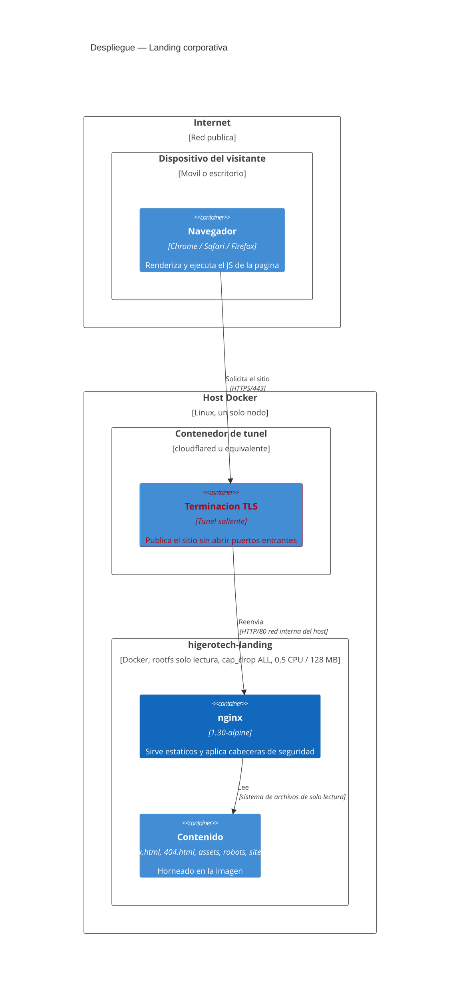
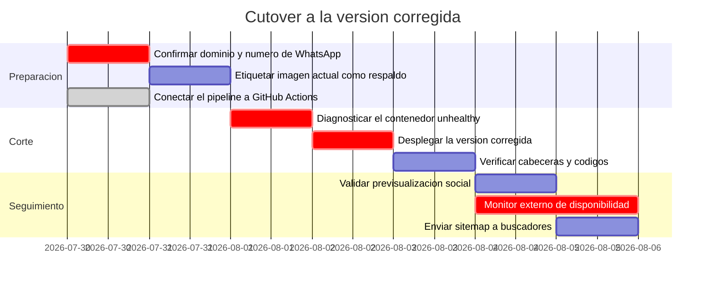

# Despliegue — Landing corporativa Higerotech

* **Estado:** review
* **Fecha:** 2026-07-29
* **Decisores:** Jeremi Alcalá
* **Fase AI-DLC:** 05-deployment
* **Versión:** 0.3.0
* **Gate:** 4 — **parcial**
* **Entorno objetivo:** Host único con Docker; borde expuesto mediante túnel
* **Estrategia de release:** Reemplazo directo del contenedor (sin blue-green ni canary)

## Topología



*Eje estructura · Fase 05 · Dónde corre cada contenedor.*

Detalle relevante para la seguridad: el túnel es **saliente**, así que el host no abre
puertos entrantes al exterior. Eso reduce mucho la superficie de red y es parte de por qué
T10 (saturación) se acepta sin rate limiting.

### El borde, en concreto

Confirmado el 2026-07-30 con `docker inspect landing-tunnel` y sus propios logs:

| Dato | Valor |
|---|---|
| Software | **cloudflared** en modo token (`tunnel run --token …`) |
| Dónde vive el *ingress* | Panel de Cloudflare, **no** en este repositorio ni en el host |
| Origen configurado | `http://192.168.1.44:80` — la **IP del host**, no la del contenedor |
| Hostnames enrutados | `www.higerotech.com`, `web.higerotech.com`, `demo.higerotech.com` |
| Regla final | `http_status:404` |
| Terminación TLS | Cloudflare, en el borde. Del túnel al host el tramo es HTTP plano (T9) |
| HSTS | Activo desde el 2026-07-31, emitido por Cloudflare: `max-age=31536000; includeSubDomains; preload` (12 meses). Ver la nota de abajo sobre `preload` |
| Redirección a HTTPS | Activa: `http://` responde 301 |

Dos consecuencias que conviene tener escritas:

1. **El puerto del host es parte del contrato con el túnel.** El origen está fijado a
   `:80`, así que `docker-compose.yml` publica en 80 y no en 8080. Cambiarlo deja el sitio
   público sin servir aunque el contenedor esté perfectamente sano. Que el origen sea la IP
   del host y no la del contenedor es una suerte: hace que la red de Docker sea indiferente
   y que recrear el contenedor no rompa el enrutado.
2. **El apex `higerotech.com` no está enrutado.** No tiene registro en DNS (la consulta
   devuelve solo SOA) y no figura en el ingress; forzando la IP de Cloudflare responde
   **HTTP 530**. Ninguno de los otros cuatro túneles del host lo sirve tampoco. Es un
   problema real de SEO, no cosmético: `canonical`, los tres `hreflang`, `og:url`, las URLs
   del `sitemap.xml` y la línea `Sitemap:` de `robots.txt` apuntan todos a
   `https://higerotech.com/`, un host que no resuelve. Y como `www`, `web` y `demo` sirven
   el mismo contenido, hay contenido duplicado en tres hostnames sin un canonical válido que
   los consolide.

### Sobre el `preload` de HSTS

La cabecera declara `preload`, y desde el 2026-07-31 la política ya es coherente con esa
declaración —el `max-age` subió a 12 meses—, **pero la directiva sigue sin efecto**. Para entrar
en la lista de precarga de los navegadores, hstspreload.org exige:

| Requisito | Estado |
|---|---|
| `max-age` ≥ 31 536 000 s (1 año) | ✅ **Corregido el 2026-07-31**: 31 536 000 s |
| `includeSubDomains` | ✅ |
| Redirección HTTP→HTTPS | ✅ 301 |
| Que el **dominio base** sirva la cabecera | ❌ El apex `higerotech.com` **no resuelve** (530) |

Queda **un solo requisito incumplido**, y es el mismo apex que bloquea el SEO. Hasta que se
enrute, el token `preload` sigue siendo una declaración sin efecto: una solicitud a
hstspreload.org se rechazaría.

Cuando el apex esté enrutado, conviene pararse antes de solicitar la precarga: **entrar en la
lista es prácticamente irreversible** —salir tarda meses en propagarse a los navegadores— y con
`includeSubDomains` alcanzaría a `media.`, `encuesta.`, `bots.` y a cualquier subdominio futuro
que naciera sin HTTPS. Solicitarla es una decisión aparte de tener la cabecera bien puesta.

`<TODO: decidir entre dar registro e ingress al apex o mover el canonical a www; y anotar
quién administra la cuenta de Cloudflare, hoy conocimiento tácito>`

## Pipeline


*Eje comportamiento · Fase 05 · Pipeline y ruta de rollback.*

Los pasos `MERGE` en adelante son **manuales hoy**. Las siete comprobaciones G1–G7 están
automatizadas en `.github/workflows/security-gates.yml` y las siete pasan: el repositorio ya
está conectado a GitHub Actions, así que Semgrep y Trivy ejecutan de verdad.

> **`Merge bloqueado` pasó de intención a hecho el 2026-07-31.** Durante meses ese nodo del
> diagrama describía algo que no ocurría: con la org en plan Free y el repositorio privado,
> GitHub no ofrecía branch protection, así que el estado del CI no condicionaba el merge. Al
> hacerse público el repositorio, `main` quedó protegido: **pull request obligatoria, los siete
> checks en verde y actualizados respecto a `main`, sin force-push, sin borrado y con los
> administradores incluidos**. Cero aprobaciones requeridas, para no bloquear a un mantenedor
> único. `.githooks/pre-push` se conserva como barrera local redundante.

Los gates G5, G6 y G7 son específicos de este proyecto y merecen justificación: existen para
que los tres defectos corregidos en `7c7bc78` no puedan volver. G5 comprueba las cabeceras en
**cuatro rutas distintas**, no solo en `/`, porque el bug original era precisamente que
llegaban a unas rutas y a otras no.

## Verificación

Comprobaciones ejecutadas contra la imagen construida el **2026-07-29**. Reproducibles con
`docker compose up -d --build`.

### Cabeceras de seguridad

```bash
curl -sI http://localhost/ | grep -i -E 'frame|nosniff|referrer|permissions|content-security'
```

Resultado sobre `/`:

```
Content-Security-Policy: default-src 'self'; script-src 'self' 'unsafe-inline'; style-src 'self' 'unsafe-inline'; img-src 'self' data:; font-src 'self'; connect-src 'self'; form-action 'self'; frame-ancestors 'none'; base-uri 'self'; object-src 'none'; upgrade-insecure-requests
Cross-Origin-Opener-Policy: same-origin
Cross-Origin-Resource-Policy: same-origin
Permissions-Policy: geolocation=(), microphone=(), camera=(), interest-cohort=()
Referrer-Policy: strict-origin-when-cross-origin
X-Content-Type-Options: nosniff
X-Frame-Options: DENY
```

Verificado presente además en `/index.html`, `/assets/fonts/fonts.css`,
`/assets/og-card.png`, `/robots.txt`, `/sitemap.xml` y rutas inexistentes.

### Códigos de estado y tipos de contenido

| Ruta | Código | `Content-Type` | `Cache-Control` |
|---|---|---|---|
| `/` | 200 | `text/html` | `no-cache, must-revalidate` |
| `/index.html` | 200 | `text/html` | `no-cache, must-revalidate` |
| `/robots.txt` | 200 | `text/plain` | `max-age=86400` |
| `/sitemap.xml` | 200 | `text/xml` | `max-age=86400` |
| `/assets/fonts/fonts.css` | 200 | `text/css` | `public, max-age=2592000, immutable` |
| `/assets/fonts/inter-latin.woff2` | 200 | `font/woff2` | `public, max-age=2592000, immutable` |
| `/ruta-que-no-existe` | **404** | `text/html` | — |
| `/assets/no-existe.png` | **404** | `text/html` | — |

`Server: nginx` — sin número de versión (`server_tokens off`).

### Comportamiento en navegador

Verificado en Chrome contra la imagen construida:

| Comprobación | Resultado |
|---|---|
| Fuentes cargadas | `Inter 400 700` y `Space Grotesk 400 700` — variables, same-origin |
| Familia aplicada a `h1` | `Space Grotesk` |
| SVG sin `aria-hidden` | 0 de 34 |
| Saltos de nivel de encabezado | Ninguno |
| Botón de WhatsApp | Oculto (sin número configurado) — no se publica CTA muerto |
| Año del pie | Dinámico |
| Cambio a EN | `html lang="en"`, `aria-pressed` sincronizado, preferencia guardada |
| Cuatro cambios de idioma seguidos | 130 nodos i18n intactos; `<span class="grad">`, `<strong>` y el año conservados |
| `?lang=en` | Aplica inglés desde la carga; URL compartible |
| Menú móvil | Panel abre/cierra; Escape cierra; pulsar enlace cierra; áreas táctiles de 51 px |
| Enmarcado en iframe | **Bloqueado** por `frame-ancestors 'none'` |
| Errores de consola | Ninguno |

Nota metodológica: la media query móvil se verificó por CSSOM y con las reglas aplicadas
manualmente, porque la ventana del entorno de pruebas no bajaba de 2560 px. La lógica JS sí
se ejecutó de verdad. Queda como candidata a prueba E2E real (Gate 3).

## Procedimiento de despliegue

```bash
# 1. Construir y verificar la configuracion (nginx -t corre dentro del build)
docker compose build

# 2. Levantar
docker compose up -d

# 3. Verificar antes de dar por bueno
curl -sI http://localhost/ | grep -ci -E 'frame|nosniff|referrer|permissions|content-security'   # => 5
curl -s -o /dev/null -w '%{http_code}\n' http://localhost/no-existe                              # => 404
docker compose ps                                                                                 # => healthy

# 4. Y por el borde, que es lo que ve el visitante
curl -sI https://www.higerotech.com/ | grep -ci -E 'frame|nosniff|referrer|content-security|strict-transport'  # => 5
```

El puerto es 80, no 8080: ver §El borde. Y la comprobación 4 no es redundante —el paso 3
valida la imagen, el 4 valida que el túnel apunte a ella. El 2026-07-30 el paso 3 daba verde
contra la imagen mientras el borde servía otra cosa (ver §Hallazgo operativo).

Si el paso 3 no da esos tres resultados, no se publica: se hace rollback.

## Rollback

| Disparador | Acción | Tiempo objetivo |
|---|---|---|
| Cabeceras ausentes en cualquier ruta tras desplegar | Rollback inmediato | < 5 min |
| Healthcheck en `unhealthy` más de 2 minutos | Rollback inmediato | < 5 min |
| La página no renderiza o queda en blanco | Rollback inmediato | < 5 min |
| Error 5xx sostenido | Rollback inmediato | < 5 min |
| Regresión visual o de copy | Evaluar; corregir hacia adelante si no es crítico | < 24 h |

```bash
# Volver al tag anterior
docker compose down
docker tag higerotech/landing:<tag-anterior> higerotech/landing:latest
docker compose up -d

# Verificar que el rollback funciono
curl -sI http://localhost/ | head -1
docker compose ps
```

**Requisito para que esto funcione:** las imágenes deben etiquetarse con la versión, no solo
con `latest`. Hoy `docker-compose.yml` fija `image: higerotech/landing:latest`, así que **no
hay imagen anterior a la que volver**. Es una carencia real del runbook.

Dejó de ser hipotética el 2026-07-30. Al preparar el cutover se intentó etiquetar la imagen
que corría en producción como punto de rollback y **la imagen ya no existía**:

```
docker image inspect sha256:e916413…  → No such image
docker commit higerotech-landing …    → NotFound: content digest sha256:78f55d6… not found
```

El contenedor llevaba semanas sirviendo el sitio desde un montaje vivo cuyas capas ya habían
desaparecido del almacén de contenido: funcionaba, pero era irreconvertible en imagen. La
única copia de esa versión era el propio contenedor en marcha. Por eso el cutover **no lo
borró**: se le puso `--restart=no`, se renombró a `higerotech-landing-pre-cutover` y se detuvo,
y su contenido se extrajo aparte con `docker cp`. Borrar ese contenedor destruye la última
copia de lo que estuvo publicado.

La lección es más fuerte que el `<TODO>` original: no basta con etiquetar por versión, hay que
**empujar las imágenes a un registro**. Una etiqueta local no sobrevive a un `docker system
prune`, y un rollback que depende de que nadie haya limpiado el host no es un rollback.

`<TODO: etiquetar las imágenes con el tag SemVer del release, empujarlas a un registro y
conservar al menos las dos últimas. Sin esto, el procedimiento de rollback descrito arriba no
es ejecutable.>`

## Plan de cutover



*Eje trazabilidad · Fase 05 · Secuencia de corte y dependencias.*

Las tres tareas `crit` marcan el camino crítico. La primera lo es porque el dominio y el
número condicionan contenido ya desplegado (canonical, `hreflang`, Open Graph y el CTA de
WhatsApp): desplegar antes de confirmarlos obliga a redesplegar.

## Estado del Gate 4

Cerrado: configuración validada en build, cabeceras verificadas en todas las rutas,
contenedor endurecido, límites de recursos, runbook con disparadores y plan de cutover.

Abierto: pipeline real conectado, SBOM, imagen anclada por digest, firma de imagen,
etiquetado de versiones que haga ejecutable el rollback, y documentación del borde TLS.

Detalle en [`.ai-dlc/gates/gate-4-deployment.md`](../../.ai-dlc/gates/gate-4-deployment.md).

## Hallazgo operativo — cerrado el 2026-07-30

El 2026-07-29, al listar los contenedores del host, se observó:

```
higerotech-landing | Up 24 hours (unhealthy) | 0.0.0.0:80->80/tcp
```

Un `landing-tunnel` corriendo en paralelo sugiere que ese contenedor es el que publica el
sitio. Lleva 24 horas con el healthcheck fallando y **nadie se enteró**: es la amenaza T16
del threat model materializada.

**Diagnóstico (2026-07-30).** El `unhealthy` no era una avería: era un defecto del propio
repositorio. El healthcheck apuntaba a `http://localhost/`, nombre que el `/etc/hosts` de la
imagen resuelve también a `::1`; el `wget` de busybox intenta IPv6 primero y `nginx.conf` solo
declara `listen 80`. Todos los chequeos daban `connection refused` —611 seguidos— mientras
`nginx` respondía 200 con normalidad. Estaba en `Dockerfile` y en `docker-compose.yml`, así
que ninguna instancia de esta imagen ha estado `healthy` nunca. Ya corregido a `127.0.0.1`.

Dos consecuencias que conviene no perder de vista:

1. El disparador de rollback «healthcheck en `unhealthy` más de 2 minutos» de la sección
   anterior era **inejecutable** hasta este arreglo: aplicado al pie de la letra habría
   revertido cada despliegue, incluidos los buenos.
2. El contenedor en producción no salió de este `docker-compose.yml`. Se creó el 2026-07-14
   con `docker run`: publica en el puerto 80 y no en 8080, y `docker inspect` devuelve
   `ReadonlyRootfs: false` y `CapDrop: []`. El endurecimiento descrito en este documento está
   en el archivo, no en lo que sirve el sitio ahora mismo.

**Lo que el diagnóstico destapó de verdad.** El `unhealthy` era el síntoma menor. Al medir el
sitio público con `curl -sI` resultó que producción no se parecía a nada de lo que este
documento daba por verificado. Medido en los dos extremos el 2026-07-30, antes del cutover:

| Control | Producción (contenedor del 2026-07-14) | Imagen de este repositorio |
|---|---|---|
| CSP | **ausente** | presente y cerrada |
| X-Frame-Options / X-Content-Type-Options / Referrer-Policy / Permissions-Policy | **las cuatro ausentes** | las cuatro |
| `Server:` | **`nginx/1.27.5`** — versión expuesta | `nginx` |
| Imagen base | 1.27.5: los 36 CVEs corregibles (2 CRITICAL, 34 HIGH) | 1.30: cero |
| Healthcheck | roto (611 fallos seguidos) | `healthy` |
| `read_only` / `cap_drop` | `false` / `[]` | `true` / `[ALL]` |
| Contenido | anterior a `7c7bc78`, con los tres bugs | corregido |

Ninguna fila de esa tabla es una diferencia de matiz. Los gates G5 (cabeceras) y G7 (versión
de nginx expuesta) pasaban en verde en cada PR **contra la imagen**, mientras el sitio real los
fallaba todos. Un pipeline que avala artefactos no dice nada sobre lo que hay publicado, y
esta es la evidencia concreta de esa distinción.

**Cutover ejecutado el 2026-07-30.** El contenedor viejo se apartó sin borrarlo
(`--restart=no`, renombrado a `higerotech-landing-pre-cutover`, detenido) y se levantó el nuevo
con `docker compose up -d --build`. Verificado después:

- `healthy` — por primera vez en la vida de este servicio.
- `read_only=true`, `cap_drop=[ALL]`, `no-new-privileges` activos en el contenedor que corre,
  no solo en el archivo.
- Las cinco cabeceras y `404` real en `localhost:80`; `robots.txt` y `sitemap.xml` en 200.
- Las cuatro cabeceras que Cloudflare deja pasar y `404` real en los tres hostnames públicos:
  `www`, `web` y `demo`.

Queda pendiente **HSTS**, que no puede venir de nginx: TLS lo termina Cloudflare, así que la
cabecera tiene que activarse en el borde.
