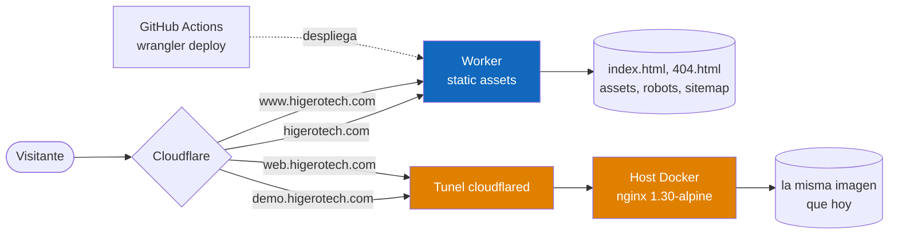

# Plan de despliegue — Cloudflare Workers con static assets

* **Estado:** en curso — **pasos 1, 2 y 3 completados el 2026-07-31**; el apex ya sirve desde el
  Worker. Pendiente el paso 4 (`www`), bloqueado por dos hallazgos que necesitan mano en Cloudflare
* **Fecha:** 2026-07-31
* **Decisores:** Jeremi Alcalá
* **Fase AI-DLC:** 05-deployment
* **Versión:** 0.1.0
* **Decisión de referencia:** [ADR-0006](../00-project/adr/0006-servir-desde-cloudflare-workers.md)
* **Estrategia:** migración por hostname, con el túnel como contingencia inmediata

## Topología objetivo



*Eje estructura · Fase 05 · Quien sirve cada hostname tras la migracion.*

Dos caminos a propósito: **azul es producción, ámbar es contingencia y pruebas.** El túnel y el
contenedor no se retiran; dejan de servir los hostnames canónicos.

## Lo que se añade al repositorio

Ya está todo en el repositorio, inerte hasta que se active el interruptor:

| Archivo | Para qué | Estado |
|---|---|---|
| `wrangler.jsonc` | Directorio de assets, `html_handling` y `not_found_handling: "404-page"` | ✅ |
| `cloudflare/_headers` | Las cabeceras de seguridad en el camino del Worker | ✅ |
| `scripts/preparar-assets.mjs` | Ensambla `dist/` desde una lista de **inclusión** | ✅ |
| `.github/workflows/desplegar-worker.yml` | `wrangler deploy` + verificación de lo publicado | ✅ |
| `tests/unit/u12-cabeceras-worker.test.mjs` | Falla si las dos definiciones de cabeceras divergen | ✅ |

`wrangler` queda anclado en el lockfile —87 paquetes, gate SCA en verde— en vez de invocarse
suelto con `npx wrangler@4`: un despliegue debe ser reproducible, no depender de lo que haya
publicado el registro esa mañana.

### Por qué una lista de inclusión y no `.assetsignore`

wrangler admite exclusiones, y sería más corto apuntar el Worker a la raíz e ir tachando
`node_modules`, `docs`, `tests`… Pero una lista de exclusión **falla hacia el lado peligroso**:
el día que aparezca un archivo nuevo —un volcado, un `.env` de pruebas— se publica solo porque
nadie se acordó de añadirlo. El `Dockerfile` usa inclusión desde el principio y por eso nunca se
ha colado nada en la imagen. **U12.3** comprueba que ambas listas digan lo mismo.

### La URL de verificación se deriva, no se configura

La primera versión del workflow leía la URL a verificar de una variable de repositorio. Es un
error de la misma familia que este repositorio lleva semanas corrigiendo: **la variable puede
decir una cosa mientras el despliegue fue a otra**, y entonces la verificación da verde sobre
algo que no es lo que se acaba de publicar.

Ahora se extrae de la salida de `wrangler deploy`, y si no se puede extraer el job falla en vez
de verificar a ciegas. `workers_dev: true` en `wrangler.jsonc` garantiza que esa URL exista, que
es lo que hace comprobable el paso 1 **antes de tocar ningún DNS**.

También se desactiva la telemetría de wrangler (`WRANGLER_SEND_METRICS=false`): el mismo criterio
que llevó a autoalojar las fuentes para no filtrar la IP de los visitantes (ADR-0004).

### El interruptor

El workflow solo corre si existe la variable de repositorio `DESPLIEGUE_WORKER=activado`.
Deliberado: mientras no exista el token, este workflow pondría en rojo **cada merge a `main`**
sin que nada esté roto de verdad, y un CI que falla por diseño enseña a ignorar los fallos.

### Por qué `not_found_handling: "404-page"`

Verificado en el esquema de wrangler 4.118: admite `404-page`, `single-page-application` y
`none`. Con `404-page` una ruta inexistente devuelve **404 de verdad** con `/404.html`, que es
justo lo que costó un bug y un ADR conseguir en nginx —antes `try_files … /index.html` devolvía
200 con la landing, un *soft 404*—. Elegir `single-page-application` reintroduciría ese defecto.

### Por qué una prueba que compare las cabeceras

Van a existir dos definiciones de lo mismo, sin build que las sincronice. Este repositorio ya
tiene el precedente: al inlinar el `@font-face` para ahorrar un round trip, las reglas quedaron
duplicadas y hubo que escribir **U2.5** para que la deriva fuera un fallo y no una sorpresa.
Aquí aplica igual, y con más motivo: son cabeceras de seguridad.

## Lo que hay que hacer en Cloudflare

Estas tres cosas no están en el repositorio y las tiene que hacer una persona con acceso a la
cuenta:

1. **Token de API** con permiso `Workers Scripts: Edit` sobre la cuenta, y **solo eso**. Se
   guarda como secreto `CLOUDFLARE_API_TOKEN` del repositorio, junto a `CLOUDFLARE_ACCOUNT_ID`.
   Es una credencial que puede desplegar: alcance mínimo y rotable.
2. **Dominios propios del Worker** para `higerotech.com` y `www.higerotech.com`. Cloudflare crea
   los registros DNS necesarios — incluido el del **apex, que hoy no existe**.
3. **Retirar del ingress del túnel** las entradas de `www` y del apex, dejando `demo.` y `web.`.

## Secuencia de cutover

Diseñada para que en ningún paso el sitio quede sin servir, y para poder volver atrás en
minutos.

| # | Paso | Cómo se comprueba |
|---|---|---|
| 1 | ~~Añadir los archivos del Worker y desplegar a un `*.workers.dev`~~ | ✅ **Hecho el 2026-07-31** — ver §Resultado del paso 1 |
| 2 | ~~Enrutar **solo el apex** al Worker~~ | ✅ **Hecho el 2026-07-31** — 200 en vez de 530 |
| 3 | ~~Verificar el apex con el suite completo~~ | ✅ **Hecho** — 54/58, y los 4 fallos destaparon algo real; ver §Resultado de los pasos 2 y 3 |
| 4 | Mover `www` al Worker y quitarlo del ingress | Paso 4 de §Verificar antes de publicar, ahora contra el Worker |
| 5 | Dejar `demo.` en el túnel como estaba | `curl -sI https://demo.higerotech.com/` sigue sirviendo desde el contenedor |

**El paso 2 es deliberadamente el apex y no `www`.** Hoy el apex no sirve a nadie —responde
530—, así que es el único hostname donde un fallo no tiene consecuencias. Se estrena la
infraestructura nueva donde no hay tráfico que perder.

## Resultado del paso 1 *(2026-07-31)*

Desplegado en `https://higerotech-landing.jeremialcala.workers.dev`, con las **58 E2E en verde
contra el Worker real** (32 s) desde el propio workflow, más comprobación aparte:

| Comprobación | Resultado |
|---|---|
| Las cinco cabeceras de seguridad | ✅ |
| COOP + COEP + CORP | ✅ |
| Ruta inexistente → **404 real** | ✅ |
| `robots.txt`, `sitemap.xml`, fuentes | ✅ 200 |
| Cabeceras **en las propias redirecciones** | ✅ 5 de 5 |

La última se comprobó aparte a propósito: una redirección que saliera sin CSP sería un hueco
pequeño y fácil de no ver. `_headers` con `/*` sí las aplica.

**Todo esto sin tocar un solo registro DNS.** El sitio en producción siguió sirviéndose por el
túnel durante toda la operación.

### Fricción de puesta en marcha, para que no se repita

Tres intentos fallidos antes del bueno, y ninguno de los tres motivos era obvio:

1. **`DESPLIEGUE_WORKER` se creó como *secreto* en vez de *variable*.** `vars.` no puede leer
   secretos, así que el job **se saltó en silencio** — que es el modo de fallo más caro: parece
   que no pasó nada. Están en pestañas contiguas de la misma pantalla. El interruptor no es
   sensible —su valor es `activado`— y le corresponde ser variable.
2. **El token autenticaba pero no autorizaba.** `wrangler whoami` funciona perfectamente con un
   token sin `Workers Scripts: Edit`: resuelve la cuenta y no se queja. Es decir, **que la
   autenticación funcione no dice nada sobre si podrá desplegar**. El fallo aparece al llamar a
   `workers/services`, con `Authentication error [code: 10000]`, que suena a credencial inválida
   y es un permiso ausente.
3. **El log despista.** wrangler sugiere `User → Memberships → Read`, que es para la parte
   cosmética de `whoami` y **no** es la causa. Concederlo amplía el token sin arreglar nada.

Un detalle de diagnóstico que ahorró trabajo: en la tabla de `whoami`, el ID de cuenta que
devolvió la API salía como `***`. GitHub solo enmascara lo que **coincide con un secreto**, así
que ver el ID oculto demuestra que el configurado y el del token son el mismo — descarta la
hipótesis del ID equivocado sin abrir el panel.

## Resultado de los pasos 2 y 3 *(2026-07-31)*

El apex responde **200** donde antes daba 530. Para confirmar que lo sirve el Worker y no el túnel
se usó **el discriminador que salió del paso 1**: la redirección de `/index.html`, que en el Worker
es 307 y en nginx 200. Aquella diferencia se documentó como curiosidad y acabó siendo la
herramienta de diagnóstico.

| Hostname | `/index.html` | `/404.html` | Origen real |
|---|---|---|---|
| `higerotech.com` | 307 → `/` | 307 | **Worker** ✅ |
| `higerotech-landing…workers.dev` | 307 → `/` | 307 | Worker |
| `demo.higerotech.com` | 200 | 404 | nginx, por el túnel ✅ |
| `web.higerotech.com` | 200 | 404 | nginx, por el túnel ✅ |

Las cinco cabeceras, COOP/COEP/CORP y el HSTS con `preload` salen correctos por el apex.

El suite completo contra `https://higerotech.com`: **54 de 58**. Los cuatro fallos son **una sola
causa raíz**, y no es del Worker.

### Hallazgo 1 — `www.higerotech.com` dejó de existir

**NXDOMAIN**, confirmado por dos resolvers independientes (1.1.1.1 y 8.8.8.8: `Status: 3`, sin
`Answer`). No es caché local — el registro no está.

Y estaba hace unas horas. Medido en esta misma máquina:

| Cuándo | Resultado |
|---|---|
| 2026-07-30 02:40 | `www.higerotech.com -> 172.67.165.34, 104.21.11.40` |
| 2026-07-31 02:15 | responde; se le mide HSTS junto a `web.` y `demo.` |
| 2026-07-31 16:53 | **NXDOMAIN** |

Desapareció en la ventana en la que se engancharon los dominios propios del Worker. **El daño es
pequeño, y conviene decir por qué**: `canonical`, los tres `hreflang`, `og:url`, `sitemap.xml` y
`robots.txt` apuntan todos al **apex**, que sí funciona. Lo que se rompe son los enlaces externos
y marcadores que apunten a `www`, y las instrucciones de verificación del `README` y de
`deployment.md`, que mandan mirar precisamente `www`.

**Decisión pendiente**, y el paso 4 ya iba en esa dirección: engancharlo como segundo dominio
propio del Worker. La alternativa —devolverle el CNAME al túnel— solo tiene sentido para
posponer.

### Hallazgo 2 — Cloudflare inyecta un script de terceros, y la CSP lo bloquea

En **todos** los hostnames de la zona, el HTML servido lleva añadido:

```html
<script type="module" src="https://static.cloudflareinsights.com/beacon.min.js/..."
        data-cf-beacon="{&quot;version&quot;:&quot;2024.11.0&quot;, ...}">
```

Es la inyección automática de **Cloudflare Web Analytics**, activada a nivel de zona.

Dos cosas que costó ver y merecen quedar escritas:

1. **Solo se inyecta a peticiones de navegador.** Un `curl` normal —`Accept: */*`— devuelve el
   HTML **byte a byte idéntico** al desplegado: 84 034 bytes en el apex, en `workers.dev` y en el
   repositorio. Con `Accept: text/html` son **84 393**. Los 359 bytes de diferencia son el
   `<script>`. Cualquier comprobación hecha con `curl` a secas **no lo ve**.
2. **No lo causó el Worker.** Está también en `demo.` y `web.`, que van por el túnel a nginx, y
   **no** está en `workers.dev`, que no pertenece a la zona. Es decir: llevaba puesto en
   producción, y el paso 3 es simplemente **la primera vez que el suite se ejecuta contra un
   hostname de la zona**.

| Hostname | ¿beacon inyectado? |
|---|---|
| `higerotech.com` | sí |
| `demo.higerotech.com` | sí |
| `web.higerotech.com` | sí |
| `…workers.dev` | **no** |

**La CSP lo bloquea.** `script-src 'self'` → violación `script-src-elem`, y el script no se
ejecuta:

```
Loading the script 'https://static.cloudflareinsights.com/beacon.min.js/...' violates the
following Content Security Policy directive: "script-src 'self' 'unsafe-inline'".
The action has been blocked.
```

O sea que **la analítica nunca funcionó** y, a la vez, **ningún dato de visitante llegó a salir**.
La segunda capa aguantó. Pero deja una violación de CSP y un error de consola en cada carga, que
es justo el ruido que hace que un día se deje de mirar la consola.

Y choca de frente con **ADR-0004**: las fuentes se autoalojan precisamente para no filtrar la IP
de los visitantes a un tercero. Tener un beacon de terceros inyectado por el borde contradice esa
decisión, aunque hoy lo salve la CSP.

**Acción pendiente**: desactivar la inyección automática de Web Analytics en la zona. Meter
`static.cloudflareinsights.com` en la CSP sería la otra salida, y es la equivocada: arreglaría el
síntoma aceptando justo lo que ADR-0004 rechaza.

Los cuatro fallos —E5.1, E5.4, E5.6 y E9.5— son este mismo beacon visto desde cuatro ángulos:
violación de CSP, petición fuera del origen, error en consola y ruido en la prueba de inyección.
No hay que tocar ninguna de las cuatro: están haciendo exactamente su trabajo.

### Lo que esto enseña sobre **dónde** se mide

El suite siempre ha corrido contra `localhost`, contra el contenedor o contra `workers.dev`.
**Nunca contra un hostname de la zona.** Todo lo que el borde añade —inyecciones, reglas de
transformación, Rocket Loader, ofuscación de correo— era invisible para los diez gates, y lo
seguiría siendo.

Es la misma familia que la deriva de dos semanas: los gates avalaban un artefacto correcto
mientras lo que recibía el visitante era otra cosa. **Acción:** que la verificación posterior al
despliegue apunte al hostname de la zona, no solo a `workers.dev`.

## Rollback

El túnel sigue configurado y el contenedor sigue corriendo, así que volver es **una edición del
ingress**: reañadir `www` apuntando a `http://<IP del host>:80` y quitar el dominio propio del
Worker. Sin reconstruir nada.

Es la primera vez que este repositorio tiene un rollback que no depende de conservar una imagen
—el problema que apareció en el cutover del 2026-07-30, cuando la imagen anterior había
desaparecido del almacén y `docker commit` ya no podía recuperarla—.

## Lo que hay que revisar en las pruebas

La migración deja **dos pruebas midiendo el vacío** si no se tocan:

| Prueba | Qué comprueba | Contra el Worker |
|---|---|---|
| E3.6 | Que no se filtre `nginx/x.y` en `/` | Trivialmente cierto: no hay nginx |
| E9.2 | Lo mismo en una página de error | Ídem |

### Los dos caminos no redirigen igual

Medido el 2026-07-31. No es un fallo —ambos comportamientos son correctos— pero conviene tenerlo
escrito antes de mover el DAST:

| Ruta | Worker | nginx |
|---|---|---|
| `/index.html` | **307 → `/`** | 200 |
| `/404.html` | **307 → `/404`** (200) | **404** |

Vienen de sitios distintos. En el Worker es `html_handling: "auto-trailing-slash"`, que quita la
extensión y consolida la URL canónica — bueno para SEO. En nginx, `/404.html` devuelve 404 porque
está declarada como página **interna**, un idiom clásico del servidor.

**Ninguna prueba lo detectó**, y con razón: Playwright sigue redirecciones, así que ambas rutas
acaban en el mismo contenido y las aserciones se cumplen. Pero el escaneo **DAST apunta a
`/404.html` explícitamente** como segundo objetivo, y contra el Worker escanearía el destino tras
la redirección. Hay que decidir si eso basta o si el segundo objetivo pasa a ser `/404`.

Quedarse así sería introducir a propósito el patrón que este repositorio lleva semanas
desmontando: una comprobación que no puede fallar. **Acción:** marcarlas como específicas del
contenedor y, para el Worker, comprobar lo que sí tiene sentido allí —que la respuesta no
exponga cabeceras de infraestructura inesperadas—.

El resto del suite es agnóstico: apunta a `BASE_URL` y comprueba comportamiento, no
implementación.

## Lo que este plan no resuelve

- **La observabilidad sigue sin existir** (A09, Gate 5). Un Worker tiene analítica y logs
  propios, lo que hace el hueco más fácil de cerrar, pero cerrarlo no es parte de esto.
- **El SBOM y la firma de imagen** siguen pendientes en el Gate 4; aplican al contenedor, que
  sigue vivo como contingencia.
- **El gate `license`** sigue sin herramienta.
- **El `preload` de HSTS** queda desbloqueado por el apex, pero solicitarlo sigue siendo una
  decisión aparte: entrar en la lista es prácticamente irreversible.
